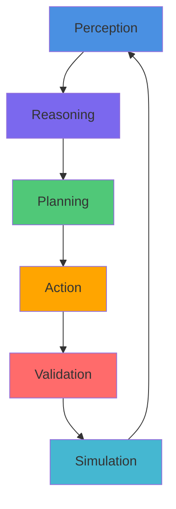

<p align="center">
  
</p>

<h1 align="center">AstraWeave — AI‑Native Game Engine</h1>

<div align="center">
  
[](https://github.com/lazyxeon/AstraWeave/actions/workflows/kani.yml) [](https://github.com/lazyxeon/AstraWeave/actions/workflows/scorecard.yml) [](https://github.com/lazyxeon/AstraWeave/actions/workflows/miri.yml) [](https://github.com/lazyxeon/AstraWeave/actions/workflows/security-audit.yml) [](https://github.com/lazyxeon/AstraWeave/actions/workflows/mutation-testing.yml) [](https://github.com/lazyxeon/AstraWeave/actions/workflows/sanitizers.yml) [](https://github.com/lazyxeon/AstraWeave/actions/workflows/codeql-analysis.yml) [](https://github.com/lazyxeon/AstraWeave/actions/workflows/clippy-unwrap-prevention.yml)

</div>

  <p align="center">
  <a href="https://github.com/lazyxeon/AstraWeave/stargazers"></a>
  <a href="https://github.com/lazyxeon/AstraWeave/blob/main/LICENSE"></a>
  <a href="https://github.com/lazyxeon/AstraWeave/blob/main/rust-toolchain.toml"></a>
  
</p>

<p align="center">
  
  
  
  
  
</p>

<div align="center">

**An AI-native game engine with deterministic ECS architecture where AI agents are first‑class citizens.**  
Built in Rust, designed for massive-scale intelligent worlds.

📚 [Documentation](docs/) • 📊 [Benchmarks](docs/masters/MASTER_BENCHMARK_REPORT.md) • 🗺️ [Roadmap](docs/masters/MASTER_ROADMAP.md)• 🧪 [Coverage](docs/current/MASTER_COVERAGE_REPORT.md) • 🕸️ [Workspace Map](https://lazyxeon.github.io/AstraWeave/architecture/) • ⚡ [Interactive Dashboard](https://lazyxeon.github.io/AstraWeave/dashboard/benchmark_dashboard/) •  🌐  [Github Pages](https://lazyxeon.github.io/AstraWeave/)  


---

### 🔍 Engine Health Status (June 10, 2026)

<!-- Source: ARCHITECTURE_MAP.md v0.7.2 (2026-06-10) + live engine-health audit
     2026-06-10 (cargo metadata --no-deps: 130 members; cargo check --workspace:
     0 errors; targeted test runs on all crates changed since 2026-05-13). -->

✅ **MIRI + KANI FORMAL VERIFICATION COMPLETE** — [Miri Report](docs/current/MIRI_VALIDATION_REPORT.md) | [Coverage Report](docs/current/MASTER_COVERAGE_REPORT.md) | [Behavioral Audit](docs/current/EDITOR_BEHAVIORAL_CORRECTNESS_AUDIT.md) | [Architecture Map v0.7.2](docs/architecture/ARCHITECTURE_MAP.md)

<!-- Source: MASTER_COVERAGE_REPORT v5.3.0 (~39,000+ #[test] markers workspace-wide;
     live re-count 2026-06-10: 39,973 incl. #[tokio::test]). Members: cargo metadata
     --no-deps 2026-06-10 = 130 (astraweave-camera added 2026-05-18, 52b9e711c).
     Editor count: 9,425 annotations (4,103 inline + 5,322 in tests/), live count
     2026-06-10, supersedes aw_editor.md §10's ~9,397 of 2026-05-12. -->
**🏆 Production-Grade Quality**: AstraWeave has **~39,000+ test annotations** across **~51 production crates** (130 workspace members via `cargo metadata`) with **59.3% weighted coverage** — 14 crates at 85%+ including ECS (96.39%), Physics (94.38%), and Nav (93.11%). The full 130-member workspace compiles with **zero errors** (`cargo check --workspace`, verified 2026-06-10). All unsafe code is **Miri-validated** and **Kani-verified**. The editor has undergone a **37-fix behavioral correctness audit** with a unified rendering pipeline now protected by a bit-identical editor↔engine parity harness.

| Metric | Status | Details |
|--------|--------|---------|
| **Build Health** | ✅ **0 errors, 130/130 members** | `cargo check --workspace` clean (2026-06-10); former known-build-issue crates (rhai authoring, egui demos, astraweave-llm) all compile |
| **Coverage** | ✅ **59.3% weighted** (P0: 55.4%, P1: 58.9%, P2: 73.9%) | **29 crates measured** via `cargo llvm-cov` (last full measurement 2026-02-25) |
| **Tests** | ✅ **~39,000+ annotations** | Core: 959, ECS: 728, Editor: 9,425 annotations, Render: 4,272+, Physics: 1,884, Net trio: 104 (all green 2026-06-10) |
| **Memory Safety** | ✅ **Miri-Validated** | 977 tests, **0 undefined behavior** across 4 crates |
| **Formal Verification** | ✅ **Kani-Verified** | 71+ proof harnesses across safety-critical crates |
| **Behavioral Correctness** | ✅ **37 fixes applied** | 8-phase audit: visual math, data pipeline, undo system, silent failures |
| **Mutation Testing** | ✅ **~2,928 tests, 4 waves** | Wave 1: 767 manual + Wave 2: 1,261 automated + Wave 3: 489 targeted + Wave 4: 411 fluids; 100% kill rate on prompts (792 mutants) |
| **Determinism** | ✅ **100% bit-identical** | Replay validation, 5-run consistency |
| **Rendering** | ✅ **Unified Pipeline + WYSIWYG parity** | Disney BRDF + multi-scatter, 4-cascade CSM, IBL cubemaps, ACES/AgX/Reinhard tonemapping; bit-identical editor↔engine parity harness |
| **Network Security** | ✅ **HMAC-SHA256 enforced** | Matchmaking trio input signing canonical end-to-end, verify-first, kick-by-default; 104 regression tests (Net-Trio-Remediation, 2026-06-10) |
| **Architecture Traces** | ✅ **13 subsystems traced** | Forensic file map / conflict map / decision log / invariants / open questions per trace |
| **Health Grade** | ✅ **A-** | Upgraded from B+ after audit remediation + unified pipeline |

<!-- Source: campaign closeout docs — docs/audits/net_trio_signature_remediation_findings_2026-06.md,
     docs/audits/unified_camera_outcome_2026-06.md, docs/audits/editor_engine_render_parity_outcome_2026-05.md,
     docs/audits/terrain_asset_quality_outcome_2026-06.md, docs/current/EDITOR_MULTI_TOOL_ARCHITECTURE_CAMPAIGN.md —
     plus the 2026-06-10 live build/test audit. -->
> **What changed (June 2026)?** Five campaigns closed and one advanced since the May snapshot. **Net-Trio-Remediation** (Jun 9–10) fixed the long-standing matchmaking-trio signature defect: canonical HMAC-SHA256 sign/verify in `aw-net-proto` (XOR `sign16` stub deleted), client and server share the same surface, the server verifies *before* any state mutation and **kicks by default** (`SignatureFailurePolicy::Kick`, WebSocket Close 1008), with TLS-path coverage — 104 trio regression tests, all green. **Unified Camera C.0–C.9** (closed Jun 1) consolidated 8 divergent camera codepaths into the new [`astraweave-camera`](astraweave-camera/) crate (`RenderView` as the sole upload payload; dual renderer upload paths and 3 parallel cinematics keyframe systems retired, net −1,549 LoC in C.6 alone). **Editor-Engine Render Parity P.1–P.7** (closed May 17) established a bit-identical (SHA-256) editor↔engine WYSIWYG contract with a public regression harness — five seams structurally protected. **Editor Multi-Tool Architecture** Sub-phases 3 and 4 closed (May 14 / Jun 6); Sub-phase 5 is in flight (5.A/5.B landed Jun 6). **Terrain Asset Quality** (closed Jun 2) baselined terrain texture VRAM at 80 MiB per active pack (31% of the 256 MB soft budget) and flagged the BC7/KTX2 cook path as non-functional (runtime uploads uncompressed RGBA8). A live build audit (Jun 10) confirmed all 130 workspace members compile clean — every entry on the former known-build-issues list (rhai authoring crates, egui demos, astraweave-llm) now passes `cargo check`.

<!-- Source: ARCHITECTURE_MAP.md v0.7.0 revision history; §0 Trace Index;
     §5 Dormant-Code Inventory; §7 Documentation Hazards. -->
> **What changed (May 2026)?** The **architecture trace campaign** completed 13 per-subsystem traces under `docs/architecture/` (terrain materials, render pipeline, physics, persistence-ECS, networking ×2, input, fluids, ECS/math/core/SDK foundation, audio, animation, AI pipeline, aw_editor). The [Architecture Map](docs/architecture/ARCHITECTURE_MAP.md) was reconciled to v0.7.0 against those traces, and the [Interactive Workspace Map](https://lazyxeon.github.io/AstraWeave/architecture/) was deployed. Specific documentation hazards were surfaced and corrected: Fluids reclassified as research surface (no production game-loop dep), the runtime LLM default drift from Qwen to `phi3:medium` was identified and later replaced with `qwen3.5:4b`, dual `World` coexistence (legacy `core::World` + ECS substrate) documented, four parallel animation type families catalogued, and the §7.7 wrapped-component resource identity trap promoted to a workspace-wide structural axiom.
>
> **Why 59.3%?** The v5.0 methodology uses `cargo llvm-cov --lib --summary-only` which instruments all compiled code including inlined dependency generics. Large GPU-only and async code paths (rendering, terrain, audio) are untestable in headless mode. See [MASTER_COVERAGE_REPORT](docs/current/MASTER_COVERAGE_REPORT.md) for full analysis.
>
> **What changed (April 2026)?** The editor underwent a comprehensive [Behavioral Correctness Audit](docs/current/EDITOR_BEHAVIORAL_CORRECTNESS_AUDIT.md): 37 fixes across 48 commits addressing shader math (GGX NDF, Fresnel energy conservation, multi-scatter compensation), undo system completion (all 9 operations now undoable), silent failure resolution (60 patterns identified, critical ones fixed), and a [7-phase architectural refactor](docs/current/FIX27_UNIFIED_PIPELINE_CAMPAIGN.md) that eliminated the dual rendering pipeline (-4,669 LOC). Health grade upgraded from B+ to A- reflecting the correctness improvements.

**Miri Validated**: astraweave-ecs (386 tests), astraweave-math (109 tests), astraweave-core (465→516 tests), astraweave-sdk (17 tests) — **ZERO undefined behavior** | [MIRI_VALIDATION_REPORT](docs/current/MIRI_VALIDATION_REPORT.md)

**Unsafe Code Validated**: BlobVec, SparseSet, EntityAllocator, SIMD intrinsics (SSE2), C ABI FFI functions — all memory-safe ✅

</div>

---

## 🚀 Quick Start

```bash
git clone https://github.com/lazyxeon/AstraWeave.git
cd AstraWeave

# Build core engine
cargo build --release -p astraweave-core

# Run the flagship AI companion demo (7 planning modes, feature-gated)
cargo run -p hello_companion --release

# Run the rendering showcase (Island scene)
cargo run -p unified_showcase --release
```

<!-- Source: live count 2026-06-10 (4,103 inline + 5,322 in tests/), supersedes
     aw_editor.md §10's ~9,397 of 2026-05-12. -->
**Note**: Editor (`aw_editor`) has 9,425 test annotations. See workflow tests in `tools/aw_editor/tests`.

**Key Documentation**:
- [Architecture Map](docs/architecture/ARCHITECTURE_MAP.md) — Crate relationships, editor viewport pipeline, data flow diagrams (v0.7.2; the v0.7.0 pass reconciled it against the 13 subsystem traces, v0.7.1–0.7.2 are incremental campaign reconciliations)
- 🕸️ [**Interactive Workspace Map**](https://lazyxeon.github.io/AstraWeave/architecture/) — Cytoscape.js-powered live visualization of 72 workspace nodes (50 production crates, 12 tools, 10 supporting members) and 190 dependency edges. Hover or click any node for crate detail (domain, status, LoC, trace link); click any edge for the load-bearing types flowing across the boundary. Toggle **blast-radius highlighting** to see what depends on a crate before you change it, or launch the **8-step guided tour** for a 10-minute architectural walk-through. Domain filter, focus mode, dependency-path finder, and shareable URL-hash state make it the fastest way to orient in the 850 K+ LoC workspace.
- [Editor Behavioral Audit](docs/current/EDITOR_BEHAVIORAL_CORRECTNESS_AUDIT.md) — 37-fix correctness audit with visual, data pipeline, and state machine verification
- [Unified Pipeline Plan](docs/current/FIX27_UNIFIED_PIPELINE_CAMPAIGN.md) — 7-phase architectural refactor eliminating the dual rendering pipeline

---

<!-- Source: ARCHITECTURE_MAP.md §0 (Trace Index) and §4 (Workspace-Wide
     Structural Axioms). Content addition per the post-trace-campaign
     reconciliation. -->
## 🔍 Engineering Methodology: The Architecture Trace Campaign

AstraWeave's architecture is documented through a forensic trace campaign covering **13 subsystems** under [`docs/architecture/`](docs/architecture/). Each trace is **evidence-grounded, version-controlled, and explicitly separates load-bearing code from in-design surface**. Trace docs are part of the production contract: when subsystem code changes, the trace updates in the same commit (see [`CLAUDE.md`](CLAUDE.md)).

The campaign produced three artifacts that together form the engine's navigational surface:

-   **[Architecture Map](docs/architecture/ARCHITECTURE_MAP.md)** — the ~1,000-line consolidated synthesis. Crate dependency graph, structural axioms, dormant-code inventory (~200K LoC across six categories), integration seams with risk levels, data flow paths, 23 cross-cutting open questions (net-trio Q17 resolved 2026-06-10). v0.7.2 reconciled 2026-06-10.
-   **[Interactive Workspace Map](https://lazyxeon.github.io/AstraWeave/architecture/)** — Cytoscape.js visualization of the 130-member workspace. Surfaces production-wired core (ECS, AI pipeline, rendering, terrain, editor) alongside ~200K LoC of dormant-but-designed surface. Click any node for crate detail, any edge for load-bearing types, or run the 8-step guided tour.
-   **[13 subsystem traces](docs/architecture/)** — terrain materials, render pipeline, physics, persistence-ECS, net, net-ECS, input, fluids, ECS/math/core/SDK foundation, audio, animation, AI pipeline, aw_editor. Each trace is forensic: §5 file map, §6 conflict map, §7 decision log, §8 invariants, §11 open questions.

The methodology — applying forensic auditing as a counterweight to AI-generated documentation drift — is part of the **[Genesis Code Protocol (GCP)](CLAUDE.md)** approach to AI-augmented development. Cross-cutting structural rules surfaced by the campaign (the §7.7 wrapped-component resource identity trap, the no-second-implementation Fix-27 lesson, the "wired beats tested" axiom, the silent-failure policy) are documented in [`ARCHITECTURE_MAP.md`](docs/architecture/ARCHITECTURE_MAP.md) §4 and applied across the workspace.

---

## 🌌 Why AstraWeave?

Traditional game engines bolt AI onto simulation. **AstraWeave weaves AI into the core.**

In AstraWeave, the "Game Loop" is an **Intelligence Loop**:
1.  **Perception**: Agents "see" the world through a snapshot system.
2.  **Reasoning**: LLMs and Utility systems analyze the state.
3.  **Planning**: GOAP and Behavior Trees formulate plans.
4.  **Action**: Plans execute via deterministic ECS commands.

<!-- Source: ai_pipeline.md §1. Hardware context appended per
     Correction 10 — single-figure claims need reference-hardware context. -->
This architecture enables **12,700+ intelligent agents** running at **60 FPS** with complex reasoning on reference hardware (HP Pavilion Gaming Laptop — [benchmarks](docs/masters/MASTER_BENCHMARK_REPORT.md#benchmark-hardware)), not just simple state machines.

---

## 🏗️ Architecture

The diagram below is the **high-level Intelligence Loop** abstraction; the actual ECS scheduler runs an **8-stage canonical pipeline** described below the diagram. See [`ARCHITECTURE_MAP.md`](docs/architecture/ARCHITECTURE_MAP.md) §3 for the full data flow.



<!-- Source: ARCHITECTURE_MAP.md §3 and CLAUDE.md ECS System Stages. Was
     "7-Stage" with the wrong stage list; reconciled to actual 8 stages. -->
**8-Stage Deterministic ECS Pipeline** (executed in canonical order, single-threaded per tick):
1. `PRE_SIMULATION` → 2. `PERCEPTION` → 3. `SIMULATION` → 4. `SYNC` (ECS ↔ legacy `core::World`) → 5. `AI_PLANNING` → 6. `PHYSICS` → 7. `POST_SIMULATION` → 8. `PRESENTATION`

Systems within a stage execute in registration order; stages execute in the order above. `ParallelSchedule` was removed 2026-04-18 (see [`docs/audits/parallel_schedule_removal_2026-04-18.md`](docs/audits/parallel_schedule_removal_2026-04-18.md)); parallelism lives at the subsystem level (rayon for terrain meshing and SPH; tokio for I/O and LLM inference; GPU compute for rendering).

---
<div align="center">
  
## ✨ Key Features

### 🧠 AI & Agents
  <!-- Source: active Ollama defaults in astraweave-llm/src/qwen3_ollama.rs and examples. -->
  **Multi-Modal Intelligence**: 6 validated AI modes (GOAP, Behavior Trees, LLM, Hybrid ensembles). Local LLM via Ollama — model configurable via `OLLAMA_MODEL` and defaults to Qwen (`qwen3.5:4b`) for active examples and probes.
  
  <!-- Source: ai_pipeline.md §1 (12,700+ agents validated). Hardware context
       added per Correction 10. -->
  **Massive Scale**: Orchestrates 12,700+ agents @ 60 FPS on reference hardware (HP Pavilion Gaming Laptop — see [benchmark hardware spec](docs/masters/MASTER_BENCHMARK_REPORT.md#benchmark-hardware)).
  
  <!-- Source: ai_pipeline.md §13.7 (LLM Production Hardening is ~15K LoC of
       dormant surface — the runtime AIArbiter path bypasses it entirely).
       Claim revised to describe what is actually wired. -->
  **LLM Integration**: Streaming API, batch executor, response caching, and tool-sandbox validation are production-wired. The broader production-hardening surface (rate limiting, circuit breakers, A/B routing, 4-tier fallback — ~15K LoC) ships as research surface and is currently bypassed by the runtime arbiter path. Q4 in [`ARCHITECTURE_MAP.md`](docs/architecture/ARCHITECTURE_MAP.md) §14.
  
  **Dynamic Terrain**: ✅ **Production** AI-orchestrated terrain generation with LLM integration.
  
  **Scripting**: **Active/Alpha** Rhai-based scripting system for behavior logic (`astraweave-scripting`).
  
  **Generative AI**: **Experimental** Asset generation pipeline (`astraweave-ai-gen`).

### ⚙️ Core Engine
  **Deterministic ECS**: Single-threaded archetype scheduler with 100% bit-identical replay validation and **Miri-validated memory safety**. Systems execute in a fixed stage order on one thread per tick; parallelism lives at the subsystem level, not inside the schedule. See [`docs/audits/parallel_schedule_removal_2026-04-18.md`](docs/audits/parallel_schedule_removal_2026-04-18.md) for the rationale behind the single-threaded-ECS choice.

  **Subsystem parallelism**: rayon drives terrain chunk meshing ([`astraweave-terrain`](astraweave-terrain/)) and optional SPH fluid simulation ([`astraweave-fluids`](astraweave-fluids/)); tokio drives async asset streaming, LLM inference, and network I/O. GPU compute handles rendering and shader work. Where the engine spends multi-core budget today is these subsystems — not the ECS tick loop.

  **Memory Safety**: All unsafe code validated with Miri (977 tests, 0 UB).

  **Sequential throughput**: at 1000 entities on the reference `profiling_demo` workload, sequential ECS median ~1 760 FPS with `fast-alloc` (mimalloc), ~1 200 FPS on the platform default allocator — measured with allocation-counter instrumentation active, across three runs each, per [`docs/audits/schedule_stage_fix_2026-04-18.md`](docs/audits/schedule_stage_fix_2026-04-18.md) §4. Scaling is approximately inverse to entity count (200e ≈ 10 k FPS, 2000e ≈ 940 FPS, 4000e ≈ 449 FPS). These numbers are measurement baselines, not shipping numbers.

  **Performance**: Fixed 60Hz simulation, SIMD acceleration (glam), cache-friendly archetype storage.

  **Networking**: Client-server architecture with delta encoding and state synchronization.

  **Persistence**: ECS world save/load with version migration.

### 🎨 Rendering (wgpu)
 **AAA Pipeline**: Disney BRDF with multi-scatter energy compensation (Turquin 2019), IBL via prefiltered cubemaps, and clustered forward lighting (100k+ lights).
 
 **Advanced Effects**: VXGI, Volumetric Fog, SSAO, SSR, Bloom, DOF, Motion Blur, 4-cascade CSM shadows with frustum fitting + texel-snap stabilization.
 
 **Optimization**: Nanite-inspired virtualized geometry, GPU occlusion culling, 3-channel DFG LUT (GGX + cloth sheen).
 
 **Materials**: Advanced shaders (Clearcoat, Sheen/Charlie, SSS, Anisotropy). Tonemapping: ACES (default), AgX, Reinhard — one shared post pipeline for engine and editor.
 
 **Unified Editor Pipeline**: Editor viewport renders through the engine — single source of truth for PBR, shadows, IBL, and post-processing, enforced by a bit-identical (SHA-256) editor↔engine parity harness (Render Parity P.1–P.7, May 2026). See [Architecture Map](docs/architecture/ARCHITECTURE_MAP.md).

### 🍎 Physics & Simulation
 **Rapier3D Integration**: Rigid bodies, character controllers, and spatial queries.
 
 **Navigation**: Navmesh generation (Delaunay) + A* pathfinding (142k queries/sec).
 
 **Terrain**: Voxel-based terrain with AI-orchestrated dynamic modification.
 
 **Audio**: Spatial audio with occlusion and dialogue runtime.

</div>

---

## 📊 Project Status

**Overall Status**: Active research-grade engine under solo development for the **Veilweaver** game project. Phase 8 (Game Engine Readiness). Active campaign: Editor Multi-Tool Architecture Sub-phase 5 (Phase 8.8 Physics Robustness paused — no physics commits since Feb 2026). Engine ships when Veilweaver ships (12–18 month horizon as of May 2026). Status icons below: ✅ production-wired · 🔧 active, mid-campaign · 🔬 research surface (in-design, not currently runtime-wired) · 🧪 experimental.

<!-- Source: ARCHITECTURE_MAP.md §5 (dormant inventory), §12 (active campaigns),
     per-trace status notes, MASTER_COVERAGE_REPORT v5.3.0 (test counts), and the
     2026-06-10 live audit. Networking row reflects Net-Trio-Remediation closeout
     (docs/audits/net_trio_signature_remediation_findings_2026-06.md). -->
| Component | Status | Notes |
| :--- | :--- | :--- |
| **Core ECS** | ✅ Production Ready | 728 tests (331 lib + 397 integration), 96.39% coverage, Miri + Kani validated. Deterministic single-threaded scheduler. |
| **Rendering** | ✅ Production Ready | 4,272+ tests, Disney BRDF + multi-scatter, 4-cascade CSM, IBL cubemaps, ACES/AgX/Reinhard tonemapping. Editor↔engine bit-identical parity harness (Render Parity P.1–P.7, closed 2026-05-17). |
| **Camera** | ✅ Production Ready | New `astraweave-camera` crate (Unified Camera C.0–C.9, closed 2026-06-01): canonical `RenderView` upload contract, two producers (FreeFly, Orbit), hardened cinematics keyframe path. 8 codepaths consolidated; 25 crate tests + 8 renderer contract tests + parity-harness matrix fixtures (all green 2026-06-10). |
| **Physics/Nav** | ✅ Production Ready | 2,380 tests (1,884 physics + 496 nav), Rapier3D wrapper. SpatialHash module dormant (1,038 LoC, doc-comment drift — Q19). Phase 8.8 robustness campaign paused since Feb 2026. |
| **AI Orchestration** | ✅ Production Ready | 921 tests (514 lib + 407 integration), validated at 12,700+ agents. Canonical GOAP + Behavior Trees + LLM hybrid arbiter. |
| **Terrain** | ✅ Production Ready | Climate field, Whittaker biome lookup, 32-layer material pipeline (21 named + 11 reserved materials), regional archetype variation. Texture VRAM budget-verified: 80 MiB/active pack (31% of 256 MB soft budget); BC7/KTX2 cook path currently non-functional (runtime uploads uncompressed RGBA8) — see Terrain Asset Quality outcome. |
| **Editor** | 🔧 Active, Mid-Campaign | 9,425 test annotations, unified engine pipeline with public parity harness. Multi-Tool Architecture campaign: Sub-phases 3 + 4 complete (2026-05-14 / 2026-06-06); Sub-phase 5 in flight (5.A/5.B landed 2026-06-06; 5.C closeout, Mediator Removal, and Sub-phase 6 pending). Behavioral Correctness post-remediation items open per [`aw_editor.md`](docs/architecture/aw_editor.md) §1/§11. |
| **Networking** | 🔧 Two Coexisting Subsystems | Snapshot-based (`astraweave-net`, JSON/WebSocket) and ECS Plugin (`astraweave-net-ecs`) with **disjoint data models**. Standalone matchmaking trio (`aw-net-{proto,client,server}`): HMAC-SHA256 input signing canonical and enforced end-to-end — server verifies first and kicks by default (`SignatureFailurePolicy::Kick`); XOR `sign16` stub deleted (Net-Trio-Remediation, 2026-06-10; 104 tests). Deliberate boundaries: no replay protection; server→client unsigned (asymmetric-trust design). See [`net_ecs.md`](docs/architecture/net_ecs.md). |
| **Prompts** | ✅ Production Ready | 1,375 tests (556 lib + 819 integration), 100% mutation kill rate (792 mutants). |
| **Scripting** (`astraweave-scripting`) | ⚠️ Alpha | 128 tests (45 lib + 83 integration), functional Rhai integration. Authoring tooling layer (`astraweave-author`, `rhai_authoring`) now compiles clean (former Rhai `Sync` trait errors resolved — verified 2026-06-10). |
| **UI Framework** | ✅ Production Ready | 751 tests (320 lib + 431 integration), functional coverage. |
| **LLM Support** | ✅ Production Ready (core) / 🔬 Hardening Layer | 16,776 lines. Core inference pipeline + tool sandbox is production-wired. The ~15K LoC production-hardening surface (rate limiting, circuit breakers, A/B routing, 4-tier fallback) is dormant — Q4 in §14. |
| **Fluids** | 🔬 Research Surface | 2,560 test markers <!-- Source: CLAIMS_REGISTRY.md#fluids-test-markers -->, PBD fluid simulation with in-crate caustics/foam (no production consumer). **In-design, not production-wired** — only `examples/fluids_demo` consumes the crate; no production game-loop crate depends on `astraweave-fluids`. Three solver/manager surfaces (`FluidSystem` + `PcisphSystem` + `WaterEffectsManager`). Q12 in §14. See [`fluids.md`](docs/architecture/fluids.md). |
| **Memory / Coordination / RAG** | 🔬 Research Surface | Memory pipeline ~11K, Coordination ~5.3K, RAG composite ~12.3K. Zero in-engine production consumers; HNSW vector index is currently a linear scan. Q11 in §14. |
| **AI Generation** | 🧪 Orphan Source | `astraweave-ai-gen/` holds 4 loose source files with no `Cargo.toml` and no crate root — not a workspace member, cannot build as-is. See the dormant-code taxonomy in [`ARCHITECTURE_MAP.md`](docs/architecture/ARCHITECTURE_MAP.md) §5. |

### 🏆 Quality Metrics
-   **Build Health**: `cargo check --workspace` clean — 130/130 members, 0 errors (verified 2026-06-10)
-   **Test Coverage**: 59.3% weighted via `cargo llvm-cov` (29 crates measured, 14 at 85%+; last full measurement 2026-02-25)
-   **Total Tests**: ~39,000+ test annotations across **130 workspace members** (live count 2026-06-10: 39,973 `#[test]`/`#[tokio::test]` markers; cargo metadata 130 members)
-   **Mutation Testing**: 4 waves — Wave 1: 767 manual + Wave 2: 1,261 automated + Wave 3: 489 targeted + Wave 4: 411 fluids (100% kill rate on prompts, 792 mutants)
-   **Memory Safety**: Miri-validated (977 tests, 0 undefined behavior across 4 crates)
-   **Formal Verification**: Kani-verified (71+ proof harnesses across safety-critical crates)
-   **Performance**: 60 FPS @ 12,700 agents on reference hardware (HP Pavilion Gaming Laptop — see [benchmark hardware spec](docs/masters/MASTER_BENCHMARK_REPORT.md#benchmark-hardware))
-   **Security**: A- (92/100) — November 2025 network-security audit (aw-net-server scope); input signing since enforced end-to-end by Net-Trio-Remediation (June 2026)
-   **Architecture Traces**: 13 subsystem traces under [`docs/architecture/`](docs/architecture/) (forensic file map / conflict map / decision log / invariants / open questions per trace)

---

## 📦 Crate Ecosystem

<!-- Source: cargo metadata --no-deps 2026-06-10 (130 members: ~51 production
     crates incl. astraweave-camera + astraweave-alloc, 12 tools, 59 examples);
     ARCHITECTURE_MAP.md §1 v0.7.2. -->
AstraWeave is a modular workspace of **~51 production crates** organized into 7 functional domains, plus 12 tools and 59 example crates (**130 workspace members** via `cargo metadata --no-deps`, verified 2026-06-10). Each crate is designed for composability, testability, and production deployment.

### 🏗️ Core Engine (9 crates)
-   **`astraweave-core`**: Foundation framework with WorldSnapshot, PlanIntent schemas, and tool registry system
-   **`astraweave-ecs`**: AI-native archetype-based ECS with deterministic scheduling and event systems
-   **`astraweave-math`**: SIMD-accelerated math operations (1.7-2.5× speedup, SSE2/AVX2/NEON support)
-   **`astraweave-profiling`**: Zero-cost Tracy integration with GPU/memory/lock tracing
-   **`astraweave-input`**: Action-based input binding system with multi-device support
-   **`astraweave-sdk`**: C ABI interface for embedding AstraWeave in external engines
-   **`astraweave-observability`**: Production telemetry, logging, and crash reporting
-   **`astraweave-optimization`**: LLM performance optimization (batching, caching, token compression)
-   **`astraweave-alloc`**: Opt-in mimalloc global-allocator shim (`fast-alloc` feature; +43% FPS on the profiling-demo workload, default-on in `profiling_demo`, `hello_companion`, and the editor)

### 🧠 AI & Intelligence (14 crates)
-   **`astraweave-ai`**: Core loop orchestration with GOAP planner and async LLM executor
-   **`astraweave-llm`**: Production LLM integration (Qwen via Ollama, prompt caching, circuit breaker; Phi-3/Hermes clients retained only as legacy comparison modules)
-   **`astraweave-llm-eval`**: Automated LLM evaluation with multi-metric scoring
-   **`astraweave-behavior`**: Behavior trees, HTN planning, GOAP with LRU plan caching
-   **`astraweave-context`**: Conversation history with token-aware sliding windows and summarization
-   **`astraweave-embeddings`**: Vector embeddings with linear-scan similarity search (cosine default; Euclidean/Manhattan/dot-product configurable). HNSW is advertised in doc-comments but not implemented — `VectorStore::search` is a brute-force scan (see the Memory / Coordination / RAG research-surface row above)
-   **`astraweave-rag`**: Retrieval-augmented generation pipeline with memory consolidation
-   **`astraweave-prompts`**: Handlebars templating with persona integration and A/B testing
-   **`astraweave-persona`**: NPC personality system with zip-based persona packs
-   **`astraweave-memory`**: Hierarchical memory (sensory/working/episodic/semantic) with SQLite persistence
-   **`astraweave-coordination`**: Multi-agent coordination framework *(Experimental)*
-   **`astraweave-director`**: Boss director with LLM orchestration and dynamic difficulty
-   **`astraweave-npc`**: NPC runtime with sensing, behavior execution, and profile management
-   **`astraweave-dialogue`**: Branching dialogue graph system with validation

### 🎨 Rendering & Assets (5 crates)
-   **`astraweave-render`**: AAA rendering pipeline (PBR, clustered lighting, VXGI, MegaLights, Nanite virtualized geometry)
-   **`astraweave-camera`**: Canonical camera types (`Projection`, `RenderView`, `CameraProducer` trait, FreeFly controller) — sole upload contract for the renderer (Unified Camera campaign, 2026-06)
-   **`astraweave-materials`**: Material graph system with PBR-E advanced shading (clearcoat, anisotropy, transmission)
-   **`astraweave-asset`**: Asset management with Nanite preprocessing and World Partition cell loading
-   **`astraweave-asset-pipeline`**: Texture and mesh optimization pipeline. BC7/ASTC cook path present but currently non-functional (placeholder encoder; runtime uploads uncompressed RGBA8 — Terrain Asset Quality outcome, 2026-06)

### 🍎 Physics & Simulation (5 crates)
-   **`astraweave-physics`**: Rapier3D integration with spatial hash, projectiles, gravity zones, and ragdoll
-   **`astraweave-nav`**: Navigation mesh with pathfinding and geometric utilities
-   **`astraweave-terrain`**: Procedural terrain with erosion, biomes, LOD, and async streaming
-   **`astraweave-fluids`**: Position-based dynamics (PBD) fluid sim with caustics, foam, and screen-space rendering
-   **`astraweave-scene`**: Scene management with world partitioning and GPU resource streaming

### 🎮 Gameplay Systems (5 crates)
-   **`astraweave-gameplay`**: Core gameplay framework (biomes, combat, crafting, quests, cutscenes)
-   **`astraweave-quests`**: Quest system with authorable steps and LLM-powered generation
-   **`astraweave-weaving`**: Emergent behavior layer with anchor system and echo currency (VeilWeaver mechanics)
-   **`astraweave-cinematics`**: Cinematic timeline system for cutscenes and scripted sequences
-   **`astraweave-pcg`**: Procedural content generation with deterministic seed-based RNG

### 🌐 Networking & Persistence (4 crates)
-   **`astraweave-net`**: Snapshot-based networking with delta compression and interest management
-   **`astraweave-net-ecs`**: ECS networking plugin with client prediction and server reconciliation
-   **`astraweave-persistence-ecs`**: ECS save/load integration with replay recording
-   **`astraweave-ipc`**: Inter-process communication for AI orchestration via WebSocket

### 🛠️ Infrastructure & Tools (8 crates)
-   **`astraweave-audio`**: Spatial audio engine with dialogue integration and TTS adapter
-   **`astraweave-ui`**: UI framework with HUD (quest tracker, minimap), menus, and accessibility
-   **`astraweave-scripting`**: Rhai-based scripting for game logic and AI behavior
-   **`astraweave-author`**: Rhai authoring for map design and encounter configuration
-   **`astraweave-security`**: Security framework with sandboxing and input validation
-   **`astraweave-secrets`**: Secrets management with keyring backend
-   **`astraweave-steam`**: Steamworks SDK integration (achievements, cloud saves, statistics)
-   **`astraweave-stress-test`**: Comprehensive stress testing and benchmarking framework

### 🔧 Additional Components
<!-- Source: live counts 2026-06-10 (editor 9,425 annotations; 59 example members
     per cargo metadata). "Working" dropped from the examples claim — the Terrain
     Asset Quality outcome doc records biome_showcase's GPU render path as a stub
     and unified_showcase as unstable. -->
-   **Tools**: `aw_editor` (active mid-campaign, 9,425 test annotations), `aw_asset_cli`, `aw_texture_gen`, `aw_save_cli`, and ~8 other build/debugging utilities (12 tool crates total)
-   **Examples**: 59 example crates including `hello_companion` (7 AI modes, feature-gated), `unified_showcase` (rendering), `biome_showcase`, `adaptive_boss`, and physics/fluids demos

---

## 🤝 Contributing

<!-- Source: CLAUDE.md (Mandate §1 "Zero Human Code") + strategic framing in
     post-trace-campaign Pages reconciliation. "100% by AI" preserved as the
     literal project mandate; the AI-augmented framing acknowledges the GCP
     methodology that produces and audits the code. -->
AstraWeave is an experimental project being built **solo through AI-augmented development** under the [**Genesis Code Protocol (GCP)**](CLAUDE.md) — a methodology that pairs AI code generation with forensic auditing (the architecture trace campaign) as a counterweight to AI-generated documentation drift. The project's mandate is zero human-written code; the audit campaign is how that mandate stays honest.

**Current Development Status:**
<!-- Source: cargo metadata + live counts 2026-06-10; MASTER_COVERAGE_REPORT v5.3.0;
     EDITOR_MULTI_TOOL_ARCHITECTURE_CAMPAIGN.md; campaign closeout docs under docs/audits/. -->
-   **~51 production crates** across 130 workspace members with 59.3% weighted LLVM coverage (~39,000+ test annotations)
-   **Editor**: Active mid-campaign with 9,425 test annotations (Multi-Tool Architecture Sub-phase 5 in flight; Sub-phases 3/4 complete)
-   **Architecture**: 13 subsystem traces under [`docs/architecture/`](docs/architecture/) + the [Architecture Map](docs/architecture/ARCHITECTURE_MAP.md) (v0.7.2) + the [Interactive Workspace Map](https://lazyxeon.github.io/AstraWeave/architecture/)
-   **Research surface (in-design, not runtime-wired)**: Fluids, Memory pipeline, Coordination, RAG composite, advanced GOAP, LLM production-hardening — see §5.1 of the architecture map
-   **Active Phases**: Editor Multi-Tool Architecture Sub-phase 5 (5.C closeout, Mediator Removal, Sub-phase 6 pending). Phase 8.8 Physics Robustness paused since Feb 2026. Recently closed: Net-Trio-Remediation (Jun 10), Terrain Asset Quality (Jun 2), Unified Camera (Jun 1), Render Parity (May 17)

See `CONTRIBUTING.md`, [`CLAUDE.md`](CLAUDE.md), and `docs/masters/MASTER_ROADMAP.md` for detailed roadmap and contribution guidelines.

---

<div align="center">

**Building the future of AI‑native gaming.**  
If this experiment interests you, please ⭐ the repo.

</div>
