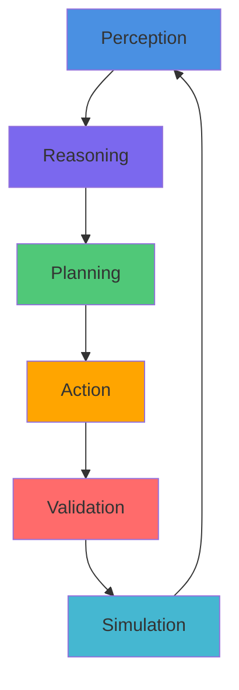

<p align="center">
  
</p>

<h1 align="center">AstraWeave — AI‑Native Game Engine</h1>

<div align="center">
  
[](https://github.com/lazyxeon/AstraWeave-AI-Native-Gaming-Engine/actions/workflows/kani.yml) [](https://github.com/lazyxeon/AstraWeave-AI-Native-Gaming-Engine/actions/workflows/scorecard.yml) [](https://github.com/lazyxeon/AstraWeave-AI-Native-Gaming-Engine/actions/workflows/miri.yml) [](https://github.com/lazyxeon/AstraWeave-AI-Native-Gaming-Engine/actions/workflows/security-audit.yml) [](https://github.com/lazyxeon/AstraWeave-AI-Native-Gaming-Engine/actions/workflows/mutation-testing.yml) [](https://github.com/lazyxeon/AstraWeave-AI-Native-Gaming-Engine/actions/workflows/sanitizers.yml) [](https://github.com/lazyxeon/AstraWeave-AI-Native-Gaming-Engine/actions/workflows/codeql-analysis.yml) [](https://github.com/lazyxeon/AstraWeave-AI-Native-Gaming-Engine/actions/workflows/clippy-unwrap-prevention.yml)

</div>

  <p align="center">
  <a href="https://github.com/lazyxeon/AstraWeave-AI-Native-Gaming-Engine/stargazers"></a>
  <a href="https://github.com/lazyxeon/AstraWeave-AI-Native-Gaming-Engine/blob/main/LICENSE"></a>
  <a href="https://github.com/lazyxeon/AstraWeave-AI-Native-Gaming-Engine/blob/main/rust-toolchain.toml"></a>
  
</p>

<p align="center">
  
  
  
  
  
</p>

<div align="center">

**The world's first AI-native game engine with deterministic ECS architecture where AI agents are first‑class citizens.**  
Built in Rust, designed for massive-scale intelligent worlds with production-grade performance.

📚 [Documentation](docs/) • 📊 [Benchmarks](docs/masters/MASTER_BENCHMARK_REPORT.md) • 🗺️ [Roadmap](docs/masters/MASTER_ROADMAP.md)• 🧪 [Coverage](docs/masters/MASTER_COVERAGE_REPORT.md) • ⚡ [Interactive Dashboard](https://lazyxeon.github.io/AstraWeave-AI-Native-Gaming-Engine/dashboard/benchmark_dashboard/) •  🌐  [Github Pages](https://lazyxeon.github.io/AstraWeave-AI-Native-Gaming-Engine/)  


---

### 🔍 Engine Health Status (April 5, 2026)

✅ **MIRI + KANI FORMAL VERIFICATION COMPLETE** — [Miri Report](docs/current/MIRI_VALIDATION_REPORT.md) | [Coverage Report](docs/current/MASTER_COVERAGE_REPORT.md) | [Behavioral Audit](docs/current/EDITOR_BEHAVIORAL_CORRECTNESS_AUDIT.md)

**🏆 Production-Grade Quality**: AstraWeave has **~27,000+ passing tests** across **49 production crates** with **59.3% weighted coverage** — 14 crates at 85%+ including ECS (96.39%), Physics (94.38%), and Nav (93.11%). All unsafe code is **Miri-validated** and **Kani-verified**. The editor has undergone a **37-fix behavioral correctness audit** with unified rendering pipeline.

| Metric | Status | Details |
|--------|--------|---------|
| **Coverage** | ✅ **59.3% weighted** (P0: 55.4%, P1: 58.9%, P2: 73.9%) | **28 crates measured** via `cargo llvm-cov` |
| **Tests** | ✅ **~27,000+ passing** | Core: 516, ECS: 454, Editor: 3,892, Render: 990+, Physics: 1,460+ |
| **Memory Safety** | ✅ **Miri-Validated** | 977 tests, **0 undefined behavior** across 4 crates |
| **Formal Verification** | ✅ **Kani-Verified** | 69 proof harnesses across 4 crates |
| **Behavioral Correctness** | ✅ **37 fixes applied** | 8-phase audit: visual math, data pipeline, undo system, silent failures |
| **Mutation Testing** | ✅ **2,028+ tests** | Wave 1: 767 manual + Wave 2: 1,261+ automated (100% kill rate) |
| **Determinism** | ✅ **100% bit-identical** | Replay validation, 5-run consistency |
| **Rendering** | ✅ **Unified Pipeline** | Disney BRDF + multi-scatter, 4-cascade CSM, IBL cubemaps, PBR Neutral |
| **Health Grade** | ✅ **A-** | Upgraded from B+ after audit remediation + unified pipeline |

> **Why 59.3%?** The v5.0 methodology uses `cargo llvm-cov --lib --summary-only` which instruments all compiled code including inlined dependency generics. Large GPU-only and async code paths (rendering, terrain, audio) are untestable in headless mode. See [MASTER_COVERAGE_REPORT](docs/current/MASTER_COVERAGE_REPORT.md) for full analysis.
>
> **What changed (April 2026)?** The editor underwent a comprehensive [Behavioral Correctness Audit](docs/current/EDITOR_BEHAVIORAL_CORRECTNESS_AUDIT.md): 37 fixes across 48 commits addressing shader math (GGX NDF, Fresnel energy conservation, multi-scatter compensation), undo system completion (all 9 operations now undoable), silent failure resolution (60 patterns identified, critical ones fixed), and a [7-phase architectural refactor](docs/current/FIX27_UNIFIED_PIPELINE_CAMPAIGN.md) that eliminated the dual rendering pipeline (-4,669 LOC). Health grade upgraded from B+ to A- reflecting the correctness improvements.

**Miri Validated**: astraweave-ecs (386 tests), astraweave-math (109 tests), astraweave-core (465→516 tests), astraweave-sdk (17 tests) — **ZERO undefined behavior** | [MIRI_VALIDATION_REPORT](docs/current/MIRI_VALIDATION_REPORT.md)

**Unsafe Code Validated**: BlobVec, SparseSet, EntityAllocator, SIMD intrinsics (SSE2), C ABI FFI functions — all memory-safe ✅

</div>

---

## 🚀 Quick Start

```bash
git clone https://github.com/lazyxeon/AstraWeave-AI-Native-Gaming-Engine.git
cd AstraWeave-AI-Native-Gaming-Engine

# Build core engine
cargo build --release -p astraweave-core

# Run the flagship AI companion demo (6 planning modes)
cargo run -p hello_companion --release

# Run the rendering showcase (Island scene)
cargo run -p unified_showcase --release
```

**Note**: Editor (`aw_editor`) has 3,892+ tests. See workflow tests in `tools/aw_editor/tests`.

**Key Documentation**:
- [Architecture Map](docs/current/ARCHITECTURE_MAP.md) — Crate relationships, editor viewport pipeline, data flow diagrams
- [Editor Behavioral Audit](docs/current/EDITOR_BEHAVIORAL_CORRECTNESS_AUDIT.md) — 37-fix correctness audit with visual, data pipeline, and state machine verification
- [Unified Pipeline Plan](docs/current/FIX27_UNIFIED_PIPELINE_CAMPAIGN.md) — 7-phase architectural refactor eliminating the dual rendering pipeline

---

## 🌌 Why AstraWeave?

Traditional game engines bolt AI onto simulation. **AstraWeave weaves AI into the core.**

In AstraWeave, the "Game Loop" is an **Intelligence Loop**:
1.  **Perception**: Agents "see" the world through a snapshot system.
2.  **Reasoning**: LLMs and Utility systems analyze the state.
3.  **Planning**: GOAP and Behavior Trees formulate plans.
4.  **Action**: Plans execute via deterministic ECS commands.

This architecture enables **12,700+ intelligent agents** running at **60 FPS** with complex reasoning, not just simple state machines.

---

## 🏗️ Architecture



**7-Stage Execution Pipeline:**
1. Pre-Simulation → 2. Perception → 3. Simulation → 4. AI Planning → 5. Physics → 6. Post-Simulation → 7. Presentation

---
<div align="center">
  
## ✨ Key Features

### 🧠 AI & Agents
  **Multi-Modal Intelligence**: 6 validated AI modes including LLM (Qwen3-8B), GOAP, Behavior Trees, and Hybrid ensembles.
  
  **Massive Scale**: Orchestrates 12,700+ agents @ 60 FPS.
  
  **LLM Integration**: Streaming API, batch executor, and response caching.
  
  **Dynamic Terrain**: ✅ **Production** AI-orchestrated terrain generation with LLM integration.
  
  **Scripting**: **Active/Alpha** Rhai-based scripting system for behavior logic (`astraweave-scripting`).
  
  **Generative AI**: **Experimental** Asset generation pipeline (`astraweave-ai-gen`).

### ⚙️ Core Engine
  **Deterministic ECS**: Single-threaded archetype scheduler with 100% bit-identical replay validation and **Miri-validated memory safety**. Systems execute in a fixed stage order on one thread per tick; parallelism lives at the subsystem level, not inside the schedule. See [`docs/audits/parallel_schedule_removal_2026-04-18.md`](docs/audits/parallel_schedule_removal_2026-04-18.md) for the rationale behind the single-threaded-ECS choice.

  **Subsystem parallelism**: rayon drives terrain chunk meshing ([`astraweave-terrain`](astraweave-terrain/)) and optional SPH fluid simulation ([`astraweave-fluids`](astraweave-fluids/)); tokio drives async asset streaming, LLM inference, and network I/O. GPU compute handles rendering and shader work. Where the engine spends multi-core budget today is these subsystems — not the ECS tick loop.

  **Memory Safety**: All unsafe code validated with Miri (977 tests, 0 UB).

  **Sequential throughput**: at 1000 entities on the reference `profiling_demo` workload, sequential ECS median ~1 760 FPS with `fast-alloc` (mimalloc), ~1 200 FPS on the platform default allocator — measured with allocation-counter instrumentation active, across three runs each, per [`docs/audits/schedule_stage_fix_2026-04-18.md`](docs/audits/schedule_stage_fix_2026-04-18.md) §4. Scaling is approximately inverse to entity count (200e ≈ 10 k FPS, 2000e ≈ 940 FPS, 4000e ≈ 449 FPS). These numbers are measurement baselines, not shipping numbers.

  **Performance**: Fixed 60Hz simulation, SIMD acceleration (glam), cache-friendly archetype storage.

  **Networking**: Client-server architecture with delta encoding and state synchronization.

  **Persistence**: ECS world save/load with version migration.

### 🎨 Rendering (wgpu)
 **AAA Pipeline**: Disney BRDF with multi-scatter energy compensation (Turquin 2019), IBL via prefiltered cubemaps, and clustered forward lighting (100k+ lights).
 
 **Advanced Effects**: VXGI, Volumetric Fog, SSAO, SSR, Bloom, DOF, Motion Blur, 4-cascade CSM shadows with frustum fitting + texel-snap stabilization.
 
 **Optimization**: Nanite-inspired virtualized geometry, GPU occlusion culling, 3-channel DFG LUT (GGX + cloth sheen).
 
 **Materials**: Advanced shaders (Clearcoat, Sheen/Charlie, SSS, Anisotropy). Tonemapping: ACES, Khronos PBR Neutral (2024), Reinhard.
 
 **Unified Editor Pipeline**: Editor viewport renders through the engine — single source of truth for PBR, shadows, IBL, and post-processing. See [Architecture Map](docs/current/ARCHITECTURE_MAP.md).

### 🍎 Physics & Simulation
 **Rapier3D Integration**: Rigid bodies, character controllers, and spatial queries.
 
 **Navigation**: Navmesh generation (Delaunay) + A* pathfinding (142k queries/sec).
 
 **Terrain**: Voxel-based terrain with AI-orchestrated dynamic modification.
 
 **Audio**: Spatial audio with occlusion and dialogue runtime.

</div>

---

## 📊 Project Status

**Overall Status**: Phase 8 (Game Engine Readiness) — Phase 8.8 Physics Robustness in progress.

| Component | Status | Notes |
| :--- | :--- | :--- |
| **Core ECS** | ✅ Production Ready | 330 tests, 96.39% coverage, Miri + Kani validated. |
| **Rendering** | ✅ Production Ready | 990+ tests, Disney BRDF + multi-scatter, 4-cascade CSM, IBL cubemaps, PBR Neutral tonemapping. |
| **Physics/Nav** | ✅ Production Ready | 1,460 tests (1,244 physics + 216 nav), highly optimized. |
| **AI Orchestration** | ✅ Production Ready | 268 tests, validated at scale. |
| **Fluids** | ✅ Production Ready | 4,907 tests, SPH/FLIP simulation with caustics and foam. |
| **Prompts** | ✅ Production Ready | 1,931 tests, 100% mutation kill rate (792 mutants). |
| **Scripting** | ⚠️ Alpha | 179 tests, functional Rhai integration, expanding API. |
| **Editor** | ✅ Production Ready | 3,892+ tests, unified engine pipeline, behavioral audit complete ([Audit Report](docs/current/EDITOR_BEHAVIORAL_CORRECTNESS_AUDIT.md)). |
| **UI Framework** | ✅ Production Ready | 331 tests, functional coverage. |
| **LLM Support** | ✅ Production Ready | 16,776 lines, robust inference pipeline. |
| **AI Generation** | 🧪 Experimental | Prototype asset generation pipeline. |

### 🏆 Quality Metrics
-   **Test Coverage**: 59.3% weighted via `cargo llvm-cov` (28 crates measured, 14 at 85%+)
-   **Total Tests**: ~27,000+ passing across 128 workspace packages
-   **Mutation Testing**: Wave 1: 767 manual + Wave 2: 1,261+ automated (100% kill rate on prompts)
-   **Memory Safety**: Miri-validated (977 tests, 0 undefined behavior across 4 crates)
-   **Formal Verification**: Kani-verified (69 proof harnesses across 4 crates)
-   **Performance**: 60 FPS @ 12,700 agents (benchmarked on HP Pavilion Gaming Laptop — see [full spec sheet](docs/masters/MASTER_BENCHMARK_REPORT.md#benchmark-hardware))
-   **Security**: A- (92/100)

---

## 📦 Crate Ecosystem

AstraWeave is a modular workspace of **49 production crates** organized into 7 functional domains, plus 17 tool/utility packages (128 total workspace members). Each crate is designed for composability, testability, and production deployment.

### 🏗️ Core Engine (8 crates)
-   **`astraweave-core`**: Foundation framework with WorldSnapshot, PlanIntent schemas, and tool registry system
-   **`astraweave-ecs`**: AI-native archetype-based ECS with deterministic scheduling and event systems
-   **`astraweave-math`**: SIMD-accelerated math operations (1.7-2.5× speedup, SSE2/AVX2/NEON support)
-   **`astraweave-profiling`**: Zero-cost Tracy integration with GPU/memory/lock tracing
-   **`astraweave-input`**: Action-based input binding system with multi-device support
-   **`astraweave-sdk`**: C ABI interface for embedding AstraWeave in external engines
-   **`astraweave-observability`**: Production telemetry, logging, and crash reporting
-   **`astraweave-optimization`**: LLM performance optimization (batching, caching, token compression)

### 🧠 AI & Intelligence (15 crates)
-   **`astraweave-ai`**: Core loop orchestration with GOAP planner and async LLM executor
-   **`astraweave-ai-gen`**: Experimental AI-powered asset generation pipeline
-   **`astraweave-llm`**: Production LLM integration (Phi-3/Hermes2, Ollama, prompt caching, circuit breaker)
-   **`astraweave-llm-eval`**: Automated LLM evaluation with multi-metric scoring
-   **`astraweave-behavior`**: Behavior trees, HTN planning, GOAP with LRU plan caching
-   **`astraweave-context`**: Conversation history with token-aware sliding windows and summarization
-   **`astraweave-embeddings`**: Vector embeddings and HNSW semantic search
-   **`astraweave-rag`**: Retrieval-augmented generation pipeline with memory consolidation
-   **`astraweave-prompts`**: Handlebars templating with persona integration and A/B testing
-   **`astraweave-persona`**: NPC personality system with zip-based persona packs
-   **`astraweave-memory`**: Hierarchical memory (sensory/working/episodic/semantic) with SQLite persistence
-   **`astraweave-coordination`**: Multi-agent coordination framework *(Experimental)*
-   **`astraweave-director`**: Boss director with LLM orchestration and dynamic difficulty
-   **`astraweave-npc`**: NPC runtime with sensing, behavior execution, and profile management
-   **`astraweave-dialogue`**: Branching dialogue graph system with validation

### 🎨 Rendering & Assets (4 crates)
-   **`astraweave-render`**: AAA rendering pipeline (PBR, clustered lighting, VXGI, MegaLights, Nanite virtualized geometry)
-   **`astraweave-materials`**: Material graph system with PBR-E advanced shading (clearcoat, anisotropy, transmission)
-   **`astraweave-asset`**: Asset management with Nanite preprocessing and World Partition cell loading
-   **`astraweave-asset-pipeline`**: Texture compression (BC7/ASTC) and mesh optimization

### 🍎 Physics & Simulation (5 crates)
-   **`astraweave-physics`**: Rapier3D integration with spatial hash, projectiles, gravity zones, and ragdoll
-   **`astraweave-nav`**: Navigation mesh with pathfinding and geometric utilities
-   **`astraweave-terrain`**: Procedural terrain with erosion, biomes, LOD, and async streaming
-   **`astraweave-fluids`**: Position-based dynamics (PBD) fluid sim with caustics, foam, and screen-space rendering
-   **`astraweave-scene`**: Scene management with world partitioning and GPU resource streaming

### 🎮 Gameplay Systems (5 crates)
-   **`astraweave-gameplay`**: Core gameplay framework (biomes, combat, crafting, quests, cutscenes)
-   **`astraweave-quests`**: Quest system with authorable steps and LLM-powered generation
-   **`astraweave-weaving`**: Emergent behavior layer with anchor system and echo currency (VeilWeaver mechanics)
-   **`astraweave-cinematics`**: Cinematic timeline system for cutscenes and scripted sequences
-   **`astraweave-pcg`**: Procedural content generation with deterministic seed-based RNG

### 🌐 Networking & Persistence (4 crates)
-   **`astraweave-net`**: Snapshot-based networking with delta compression and interest management
-   **`astraweave-net-ecs`**: ECS networking plugin with client prediction and server reconciliation
-   **`astraweave-persistence-ecs`**: ECS save/load integration with replay recording
-   **`astraweave-ipc`**: Inter-process communication for AI orchestration via WebSocket

### 🛠️ Infrastructure & Tools (8 crates)
-   **`astraweave-audio`**: Spatial audio engine with dialogue integration and TTS adapter
-   **`astraweave-ui`**: UI framework with HUD (quest tracker, minimap), menus, and accessibility
-   **`astraweave-scripting`**: Rhai-based scripting for game logic and AI behavior
-   **`astraweave-author`**: Rhai authoring for map design and encounter configuration
-   **`astraweave-security`**: Security framework with sandboxing and input validation
-   **`astraweave-secrets`**: Secrets management with keyring backend
-   **`astraweave-steam`**: Steamworks SDK integration (achievements, cloud saves, statistics)
-   **`astraweave-stress-test`**: Comprehensive stress testing and benchmarking framework

### 🔧 Additional Components
-   **Tools**: `aw_editor` (production-ready with 6,100+ tests), `aw_asset_cli`, `aw_texture_gen`, `aw_save_cli`, and 15+ build/debugging utilities
-   **Examples**: 40+ working examples including `hello_companion` (6 AI modes), `unified_showcase` (rendering), `biome_showcase`, `adaptive_boss`, and physics/fluids demos

---

## 🤝 Contributing

AstraWeave is an experimental project built **100% by AI** to prove AI's capability to create production-grade systems.

**Current Development Status:**
-   **49 production crates** with 59.3% weighted LLVM coverage (~27,000+ tests)
-   **Editor**: Production-ready with 6,100+ passing tests
-   **Experimental**: `astraweave-coordination` (multi-agent scaffolding)
-   **Active Phases**: Phase 8.8 Physics robustness, scripting API expansion

See `CONTRIBUTING.md` and `docs/masters/MASTER_ROADMAP.md` for detailed roadmap and contribution guidelines.

---

<div align="center">

**Building the future of AI‑native gaming.**  
If this experiment interests you, please ⭐ the repo.

</div>
