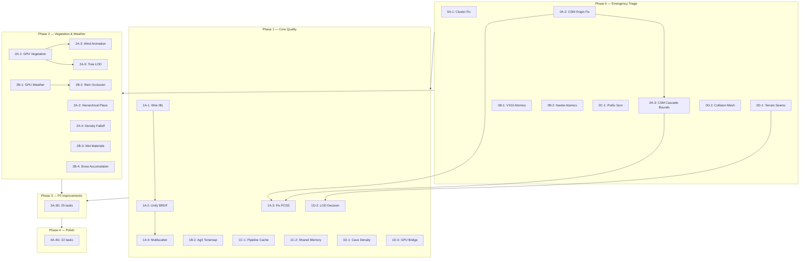

# AstraWeave Rendering Systems — Phased Remediation Plan

| Field | Value |
|-------|-------|
| **Created** | 2026-04-10 |
| **Source Reports** | `RENDERING_AUDIT_REPORT.md` (91 findings), `SHADER_AUDIT_REPORT.md` (54 findings) |
| **Deduplicated Total** | **105 unique work items** across 7 phases |
| **Version** | 1.0 |

---

## How To Use This Plan

Each phase is designed to be executed sequentially. Within each phase, tasks are organized into **work streams** that can be parallelized. Every task includes:

- **What**: Precise description of the change
- **Where**: Exact file path(s) to modify
- **How**: Step-by-step implementation guidance
- **Verify**: Specific validation command or check
- **Depends**: Any prerequisite tasks (by ID)

### Conventions

- Tasks prefixed with `[SHADER]` are WGSL-only changes
- Tasks prefixed with `[RUST]` are Rust-only changes
- Tasks prefixed with `[BRIDGE]` span Rust + WGSL
- `cargo check -p astraweave-render` must pass after every Rust change
- WGSL changes must be validated by running the relevant example or test

### Cross-Reference Key

Each task references finding IDs from the source reports:
- `R-xx` = Rendering Audit, Core Pipeline
- `G-xx` = Rendering Audit, GPU-Driven
- `M-xx` = Rendering Audit, Materials
- `L-xx` = Rendering Audit, Lighting
- `S-xx` = Rendering Audit, Shaders
- `T-xx` = Rendering Audit, Terrain
- `TR-xx` = Rendering Audit, Terrain Rendering
- `V-xx` = Rendering Audit, Vegetation
- `W-xx` = Rendering Audit, Weather Rain
- `SN-xx` = Rendering Audit, Weather Snow
- `PP-xx` = Rendering Audit, Post-Processing
- `A-xx` = Rendering Audit, Atmosphere
- `AP-xx` = Rendering Audit, Asset Pipeline
- `SA-x.x` = Shader Audit, Section.Subsection

---

## Phase 0 — Emergency Triage (P0 Critical Correctness Fixes)

**Goal**: Fix rendering that is provably wrong. Every item here produces visually incorrect output today.
**Constraint**: Zero new features. Only fix what is broken.
**All tasks independent — fully parallelizable.**

---

### Work Stream 0A: Lighting Correctness

#### Task 0A-1: Fix cluster depth slice CPU/GPU mismatch

| Field | Detail |
|-------|--------|
| **Refs** | L-01 |
| **Priority** | 🔴 P0 — All point light illumination is incorrect |
| **Type** | `[RUST]` |
| **Files** | `astraweave-render/src/clustered.rs` |
| **Depends** | None |

**What**: CPU cluster binning uses linear depth slicing. GPU fragment shader uses logarithmic. Lights are assigned to wrong clusters everywhere.

**How**:
1. Open `clustered.rs`, locate the depth-to-slice function (~line 80-85)
2. Current code: `iz = ((z - near) / (far - near)) * dims.z`
3. Replace with logarithmic: `iz = (f32::ln(z / near) / f32::ln(far / near) * dims.z as f32) as u32`
4. Clamp: `iz = iz.min(dims.z - 1)`
5. Verify the GPU-side formula in `clustered_lighting.wgsl:28-33` matches: `z_slice = log2(z / near) / log2(far / near) * cluster_z`

**Verify**:
```
cargo check -p astraweave-render
cargo test -p astraweave-render -- clustered
cargo run -p hello_companion --release  # Visual: point lights should illuminate correctly
```

---

#### Task 0A-2: Fix CSM shadow frustum locked to world origin

| Field | Detail |
|-------|--------|
| **Refs** | L-04 |
| **Priority** | 🔴 P0 — Shadows disappear as camera moves from origin |
| **Type** | `[RUST]` |
| **Files** | `astraweave-render/src/shadow_csm.rs` |
| **Depends** | None |

**What**: `scene_center = Vec3::ZERO` means shadow frustum is always centered at world origin. Camera movement breaks shadows.

**How**:
1. Open `shadow_csm.rs`, locate `scene_center = Vec3::ZERO` (~line 497)
2. Replace with camera-derived center: use the camera's world position (or the center of the camera's view frustum for the current cascade)
3. Also fix `light_distance = 50.0` (line ~500) — compute from camera frustum bounds plus a margin

**Verify**:
```
cargo check -p astraweave-render
cargo run -p hello_companion --release  # Move camera far from origin, verify shadows persist
```

---

#### Task 0A-3: Fix CSM per-cascade ortho bounds

| Field | Detail |
|-------|--------|
| **Refs** | L-03 |
| **Priority** | 🔴 P0 — All 4 cascades use identical `ortho_size = 35.0`, defeating cascading |
| **Type** | `[RUST]` |
| **Files** | `astraweave-render/src/shadow_csm.rs` |
| **Depends** | 0A-2 (use camera frustum from that fix) |

**What**: All 4 cascade shadow maps use the same orthographic bounds. Near cascades waste resolution on distant geometry.

**How**:
1. In `shadow_csm.rs` (~line 505-525), locate the cascade configuration
2. For each cascade `i` (0..4), compute tight ortho bounds from the camera frustum slice:
   - Split near/far planes using log/linear blend: `split_i = near * (far/near)^(i/4) * λ + near + (far-near)*(i/4) * (1-λ)` where `λ = 0.5`
   - Compute 8 frustum corners for the slice `[split_i, split_{i+1}]`
   - Transform frustum corners into light space
   - Compute bounding box → `ortho_size` per cascade
3. Apply texel-snapping: round ortho center to texel increments to prevent shadow shimmer

**Verify**:
```
cargo check -p astraweave-render
cargo test -p astraweave-render -- shadow
cargo run -p hello_companion --release  # Near shadows should be crisper than before
```

---

### Work Stream 0B: Shader Race Conditions

#### Task 0B-1: Fix VXGI voxelization race condition

| Field | Detail |
|-------|--------|
| **Refs** | SA-2.1, G-03 |
| **Priority** | 🔴 P0 — Data corruption in global illumination |
| **Type** | `[SHADER]` |
| **Files** | `astraweave-render/src/shaders/vxgi_voxelize.wgsl` |
| **Depends** | None |

**What**: `inject_radiance` writes to 3D texture non-atomically from parallel compute threads. Multiple threadsvoxelizing different triangles may corrupt the same voxel.

**How**:
1. Replace direct `textureStore()` with an atomic accumulation buffer (`var<storage, read_write>` of `array<atomic<u32>>`)
2. Pack radiance into u32 (R11G11B10 or RGBE8) and use `atomicAdd` per channel
3. Add a resolve pass that converts accumulated u32 back to float in the final 3D texture
4. Alternative (simpler): use `atomicMax` on a single `R32Uint` buffer if only max-intensity radiance is needed

**Verify**:
```
cargo run -p hello_companion --release  # Enable VXGI mode, verify no flickering/corruption
```

---

#### Task 0B-2: Fix Nanite SW rasterizer race condition

| Field | Detail |
|-------|--------|
| **Refs** | SA-2.1, S-02 |
| **Priority** | 🔴 P0 — Z-fighting/corruption in Nanite path |
| **Type** | `[SHADER]` |
| **Files** | `astraweave-render/src/shaders/nanite_sw_raster.wgsl` |
| **Depends** | None |

**What**: Depth test in software rasterizer uses non-atomic compare-and-swap. Overlapping triangles cause race conditions.

**How**:
1. Change depth buffer from `var<storage, read_write>` of `array<u32>` to `array<atomic<u32>>`
2. Pack depth as `u32` (float-to-uint with bit manipulation preserving ordering)
3. Replace depth write with `atomicMin(&depth_buffer[pixel_idx], packed_depth_triangle_id)`
4. The packed value should be `(depth_bits << 8) | triangle_id_low_8bits` or just `depth_bits` if triangle ID isn't needed for visibility

**Verify**:
```
cargo run -p unified_showcase --release  # Enable Nanite path, verify no z-fighting artifacts
```

---

### Work Stream 0C: GPU Performance Bottleneck

#### Task 0C-1: Wire parallel prefix sum for MegaLights

| Field | Detail |
|-------|--------|
| **Refs** | S-01, SA-2.2, SA-3.1 |
| **Priority** | 🔴 P0 — Serial `@workgroup_size(1,1,1)` wastes 97% GPU occupancy |
| **Type** | `[BRIDGE]` |
| **Files** | `astraweave-render/src/clustered_megalights.rs`, `astraweave-render/src/shaders/megalights/prefix_sum.wgsl` |
| **Depends** | None |

**What**: MegaLights prefix sum runs on a single GPU thread. The parallel subgroup-optimized version already exists at `astraweave-render/shaders/subgroup/prefix_sum_subgroup.wgsl` but isn't wired.

**How**:
1. In `clustered_megalights.rs`, locate where `prefix_sum.wgsl` is loaded (likely `include_str!` or `ShaderModuleDescriptor`)
2. Replace with `prefix_sum_subgroup.wgsl` path
3. Add feature detection: check for `wgpu::Features::SUBGROUPS` at device creation
4. If subgroups unavailable, implement Blelloch parallel scan as shared-memory fallback in new `prefix_sum_shared.wgsl`:
   - `@workgroup_size(256)` with `var<workgroup> temp: array<u32, 512>`
   - Up-sweep (reduce) + down-sweep phases
5. Update dispatch dimensions: old was `dispatch(1,1,1)`, new is `dispatch(ceil(N/256), 1, 1)`

**Verify**:
```
cargo check -p astraweave-render
# GPU profiler timestamps before/after — expect >10× speedup on prefix sum pass
```

---

### Work Stream 0D: Terrain Correctness

#### Task 0D-1: Fix terrain chunk LOD seam cracks

| Field | Detail |
|-------|--------|
| **Refs** | T-01 |
| **Priority** | 🔴 P0 — Visible cracks between terrain chunks at different LOD levels |
| **Type** | `[RUST]` |
| **Files** | `astraweave-terrain/src/lod_manager.rs`, `astraweave-terrain/src/meshing.rs` (or equivalent mesh generation) |
| **Depends** | None |

**What**: Adjacent chunks with different LODs produce mismatched vertices at shared boundary, causing skybox-visible crack artifacts.

**How** (choose one strategy):
1. **Boundary vertex snapping** (simpler): After mesh generation, detect boundary vertices. For each boundary vertex adjacent to a coarser LOD chunk, snap it to the nearest vertex position in the coarser mesh. Requires knowing neighbor LOD levels.
2. **Skirt geometry** (more robust): Generate degenerate-triangle "skirts" that extend downward from chunk edges. Covers any gap regardless of neighbor LOD. Add 4 strips (N/S/E/W edges) with vertices projected downward by `skirt_depth` (e.g., 5.0 units).

**Verify**:
```
cargo check -p astraweave-terrain
cargo test -p astraweave-terrain
# Visual: fly over terrain with varying LODs, no blue/sky visible through cracks
```

---

#### Task 0D-2: Generate terrain collision meshes

| Field | Detail |
|-------|--------|
| **Refs** | T-02 |
| **Priority** | 🔴 P0 — Entities fall through terrain (no physics colliders) |
| **Type** | `[RUST]` |
| **Files** | `astraweave-terrain/src/collision.rs` (new), `astraweave-terrain/src/lib.rs` |
| **Depends** | None |

**What**: No physics collider is generated from terrain mesh data. Acknowledged TODO in project docs.

**How**:
1. Create `astraweave-terrain/src/collision.rs`
2. After chunk mesh generation, extract vertex positions + indices
3. Generate a `CollisionMesh` struct: `{ vertices: Vec<[f32; 3]>, indices: Vec<[u32; 3]> }`
4. For heightfield-only terrain (no caves): generate `HeightfieldCollider` from sampling heightmap at regular intervals — more efficient than trimesh
5. Expose a `pub fn generate_collision_data(chunk: &ChunkMesh) -> CollisionMesh` function
6. Bridge to `astraweave-physics`: add a shared terrain collision type in `astraweave-core` or use a trait

**Verify**:
```
cargo check -p astraweave-terrain
cargo test -p astraweave-terrain
# Integration: spawn entity on terrain, verify it doesn't fall through
```

---

### Phase 0 Completion Gate

| Criterion | Check |
|-----------|-------|
| `cargo check -p astraweave-render` | ✅ Zero errors |
| `cargo check -p astraweave-terrain` | ✅ Zero errors |
| `cargo test -p astraweave-render` | ✅ All pass |
| `cargo test -p astraweave-terrain` | ✅ All pass |
| Point lights illuminate correctly | ✅ Visual verification |
| Shadows work away from origin | ✅ Visual verification |
| No terrain cracks at LOD boundaries | ✅ Visual verification |
| No VXGI/Nanite z-fighting | ✅ Visual verification |

---

## Phase 1 — Core Rendering Quality (P1 Lighting & Materials)

**Goal**: Make PBR output physically correct — IBL, unified BRDF, correct shadows.
**Prerequisite**: Phase 0 complete.

---

### Work Stream 1A: PBR Lighting Correctness

#### Task 1A-1: Wire IBL into main PBR shader

| Field | Detail |
|-------|--------|
| **Refs** | M-01 |
| **Priority** | 🟠 P1 — All indirect lighting is flat/incorrect |
| **Type** | `[BRIDGE]` |
| **Files** | `astraweave-render/shaders/pbr.wgsl`, `astraweave-render/src/renderer.rs`, `astraweave-render/src/ibl.rs` |
| **Depends** | None |

**How**:
1. In `renderer.rs`, add IBL textures to the main PBR pass bind group:
   - `brdf_lut: texture_2d<f32>` (from `IblManager`)
   - `irradiance_map: texture_cube<f32>` (from `IblManager`)
   - `prefiltered_env: texture_cube<f32>` (from `IblManager`)
   - `ibl_sampler: sampler`
2. In `pbr.wgsl`, replace the flat ambient section:
   ```wgsl
   // OLD: let ambient = scene_env.ambient_color * scene_env.ambient_intensity;
   // NEW:
   let F = fresnel_schlick_roughness(NdotV, F0, roughness);
   let kS = F;
   let kD = (1.0 - kS) * (1.0 - metallic);
   let irradiance = textureSample(irradiance_map, ibl_sampler, N).rgb;
   let diffuse_ibl = irradiance * albedo;
   let R = reflect(-V, N);
   let max_mip = f32(textureNumLevels(prefiltered_env) - 1u);
   let prefiltered = textureSampleLevel(prefiltered_env, ibl_sampler, R, roughness * max_mip).rgb;
   let env_brdf = textureSample(brdf_lut, ibl_sampler, vec2(NdotV, roughness)).rg;
   let specular_ibl = prefiltered * (F * env_brdf.x + env_brdf.y);
   let ambient = kD * diffuse_ibl + specular_ibl;
   ```
3. Multiply by `scene_env.ambient_intensity` as a user-controlled scalar

**Verify**:
```
cargo check -p astraweave-render
cargo run -p hello_companion --release  # Metals should show environment reflections, rough surfaces show soft ambient
```

---

#### Task 1A-2: Unify BRDF implementations

| Field | Detail |
|-------|--------|
| **Refs** | M-03, L-02 |
| **Priority** | 🟠 P1 — Point lights shade differently than directional |
| **Type** | `[SHADER]` |
| **Files** | `astraweave-render/shaders/pbr.wgsl`, `astraweave-render/shaders/clustered_lighting.wgsl`, `astraweave-render/shaders/pbr/disney_brdf.wgsl` |
| **Depends** | 1A-1 |

**How**:
1. Create `astraweave-render/shaders/brdf_common.wgsl` with:
   - `fn distribution_ggx(NdotH: f32, roughness: f32) -> f32`
   - `fn geometry_smith(NdotV: f32, NdotL: f32, roughness: f32) -> f32`
   - `fn fresnel_schlick(cos_theta: f32, F0: vec3<f32>) -> vec3<f32>`
   - `fn evaluate_brdf(N: vec3f, V: vec3f, L: vec3f, albedo: vec3f, metallic: f32, roughness: f32) -> vec3f`
   - Use Burley diffuse (not Lambertian) as the canonical diffuse model
2. In Rust, concatenate `brdf_common.wgsl` before `pbr.wgsl` and `clustered_lighting.wgsl` at shader compilation
3. Replace inline BRDF code in both shaders with calls to `evaluate_brdf()`
4. `disney_brdf.wgsl` remains separate for extended features (clearcoat, aniso, SSS) but its base Cook-Torrance calls `evaluate_brdf()` too

**Verify**:
```
# Side-by-side: scene lit by directional vs point light should now shade identically
cargo run -p hello_companion --release
```

---

#### Task 1A-3: Fix PCSS blocker search

| Field | Detail |
|-------|--------|
| **Refs** | L-05 |
| **Priority** | 🟠 P1 — Soft shadows show constant penumbra width |
| **Type** | `[SHADER]` |
| **Files** | `astraweave-render/shaders/shadow_sampling.wgsl` |
| **Depends** | 0A-2, 0A-3 |

**How**:
1. In `shadow_sampling.wgsl` (~line 175-180), locate the blocker search loop
2. Current: `blocker_sum += receiver_depth` — this uses the receiver's own depth as blocker estimate
3. Fix: use `textureSampleLevel(shadow_map, shadow_sampler, uv + offset, 0.0).r` to read actual shadow map depth values (comparison-free sampling)
4. Only accumulate samples where `shadow_depth < receiver_depth` (actual blockers)
5. Average blocker depth: `avg_blocker = blocker_sum / blocker_count`
6. Penumbra width: `w = (receiver_depth - avg_blocker) / avg_blocker * light_size`
7. If `blocker_count == 0`, fragment is fully lit (skip PCF)

**Verify**:
```
# Objects close to shadow caster should have sharp shadows; far from caster should have soft
cargo run -p hello_companion --release
```

---

#### Task 1A-4: Implement Kulla-Conty multiscatter energy compensation

| Field | Detail |
|-------|--------|
| **Refs** | M-02 |
| **Priority** | 🟠 P1 — 20-40% energy loss at roughness > 0.5 |
| **Type** | `[BRIDGE]` |
| **Files** | BRDF shaders, `astraweave-render/src/ibl.rs` or new `brdf_lut.rs` |
| **Depends** | 1A-2 (unified BRDF) |

**How**:
1. Generate 2D LUT at init time: `E(μ, roughness)` = directional albedo integral (already partially done in BRDF LUT)
2. In `brdf_common.wgsl`, after single-scatter BRDF evaluation, add compensation:
   ```wgsl
   let E = textureSample(brdf_lut, lut_sampler, vec2(NdotV, roughness)).r;
   let E_avg = textureSample(brdf_lut, lut_sampler, vec2(0.5, roughness)).r;  // or precomputed
   let Fms = (1.0 - E) / E;
   let Favg = (F0 + (1.0 - F0) * 0.047619);  // Turquin 2019 approximation
   let multiscatter = Fms * Favg / (1.0 - Favg * (1.0 - E_avg));
   final_spec += multiscatter * NdotL;
   ```
3. Alternative: use the Turquin 2019 analytical approximation (no extra texture) if precision is sufficient

**Verify**:
```
# High-roughness metals should appear brighter/more energetic than before
cargo run -p hello_companion --release
```

---

### Work Stream 1B: Shadow & GI Quality

#### Task 1B-1: Fix Nanite SW rasterizer atomics (also in 0B-2 — ensure completed)

Covered in Phase 0, Task 0B-2. Verify complete.

#### Task 1B-2: Implement AgX tonemapper shader

| Field | Detail |
|-------|--------|
| **Refs** | PP-01 |
| **Priority** | 🟠 P1 — Selecting AgX produces incorrect output |
| **Type** | `[SHADER]` |
| **Files** | Tonemap WGSL shader(s) |
| **Depends** | None |

**How**:
1. Add the AgX tonemapping function to the tonemap shader:
   ```wgsl
   fn agx_default_contrast_approx(x: vec3<f32>) -> vec3<f32> {
       let x2 = x * x;
       let x4 = x2 * x2;
       return + 15.5 * x4 * x2
              - 40.14 * x4 * x
              + 31.96 * x4
              - 6.868 * x2 * x
              + 0.4298 * x2
              + 0.1191 * x
              - 0.00232;
   }
   fn agx(color: vec3<f32>) -> vec3<f32> {
       let agx_mat = mat3x3(
           0.842479062253094, 0.0423282422610123, 0.0423756549057051,
           0.0784335999999992, 0.878468636469772, 0.0784336,
           0.0792237451477643, 0.0791661274605434, 0.879142973793104
       );
       var val = agx_mat * color;
       val = clamp(log2(val), vec3(-12.47393), vec3(4.026069));
       val = (val - vec3(-12.47393)) / (vec3(4.026069) - vec3(-12.47393));
       val = agx_default_contrast_approx(val);
       return val;
   }
   ```
2. Wire `TonemapOperator::AgX` to call this function in the shader's operator selection
3. Add AgX inverse EOTF if needed for output colorspace

**Verify**:
```
cargo check -p astraweave-render
# Switch tonemapper to AgX in editor, verify correct output
```

---

### Work Stream 1C: Pipeline Infrastructure

#### Task 1C-1: Enable pipeline caching

| Field | Detail |
|-------|--------|
| **Refs** | R-01 |
| **Priority** | 🟠 P1 — 2-5s cold start penalty on Vulkan |
| **Type** | `[RUST]` |
| **Files** | `astraweave-render/src/pipeline_cache.rs` (new), `astraweave-render/src/renderer.rs`, all subsystem pipeline files |
| **Depends** | None |

**How**:
1. Create `astraweave-render/src/pipeline_cache.rs` with `#![allow(unsafe_code)]` at file level
2. Implement:
   ```rust
   pub struct PipelineCacheManager {
       cache: wgpu::PipelineCache,
       cache_path: PathBuf,
   }
   impl PipelineCacheManager {
       pub fn new(device: &wgpu::Device, cache_path: &Path) -> Result<Self> {
           let data = std::fs::read(cache_path).ok();
           // SAFETY: Pipeline cache data is opaque GPU driver data.
           // Invalid data is safely rejected by the driver (returns empty cache).
           let cache = unsafe {
               device.create_pipeline_cache(&wgpu::PipelineCacheDescriptor {
                   label: Some("global_pipeline_cache"),
                   data: data.as_deref(),
                   fallback: true,
               })
           };
           Ok(Self { cache, cache_path: cache_path.to_owned() })
       }
       pub fn cache(&self) -> &wgpu::PipelineCache { &self.cache }
       pub fn save(&self) -> Result<()> {
           if let Some(data) = self.cache.get_data() {
               std::fs::write(&self.cache_path, &data)?;
           }
           Ok(())
       }
   }
   ```
3. Initialize at renderer startup, pass `Some(cache_manager.cache())` to all `create_*_pipeline()` calls
4. Save cache to disk on renderer shutdown
5. Search-replace `cache: None` → `cache: pipeline_cache.as_ref()` across all 58+ pipeline creation sites

**Verify**:
```
cargo check -p astraweave-render
# Cold start: first launch creates cache. Second launch should be 2-5s faster.
```

---

#### Task 1C-2: Add shared memory to high-impact compute shaders

| Field | Detail |
|-------|--------|
| **Refs** | S-03, SA-3.2 |
| **Priority** | 🟠 P1 — 20-40% speedup per shader |
| **Type** | `[SHADER]` |
| **Files** | `ssgi.wgsl`, `ssr.wgsl`, `megalights/count_lights.wgsl`, `nanite_sw_raster.wgsl`, `lumen/surface_cache_update.wgsl` |
| **Depends** | None |

**How**: For each shader:
1. Add `var<workgroup> tile_data: array<vec4<f32>, TILE_SIZE>` (size = workgroup width × height)
2. In entry point, load neighborhood data into shared memory cooperatively
3. `workgroupBarrier()`
4. Replace global texture reads with shared memory reads in the inner loop

Priority order (highest impact first):
1. `ssgi.wgsl` — screen-space ray march resamples depth/normal each step
2. `ssr.wgsl` — same pattern as SSGI
3. `megalights/count_lights.wgsl` — shared tile AABB for early rejection
4. `lumen/surface_cache_update.wgsl` — 14-direction radiance sampling
5. `nanite_sw_raster.wgsl` — software rasterizer tile

**Verify**:
```
# GPU profiler timestamps before/after each shader change
cargo run -p hello_companion --release
```

---

### Work Stream 1D: Cave/LOD Infrastructure

#### Task 1D-1: Implement cave/overhang density generation

| Field | Detail |
|-------|--------|
| **Refs** | T-03 |
| **Priority** | 🟠 P1 — Cave generation is a stub |
| **Type** | `[RUST]` |
| **Files** | `astraweave-terrain/src/noise_gen.rs`, `astraweave-terrain/src/structures.rs` |
| **Depends** | None |

**How**:
1. In `noise_gen.rs`, implement `sample_density()` properly:
   ```rust
   pub fn sample_density(pos: DVec3, config: &NoiseConfig) -> f64 {
       let base = sample_height_2d(pos.xz(), config);
       let height_density = base - pos.y;  // positive = underground
       let cave_noise = ridged_multi_3d(pos * config.cave_frequency, config.seed + 42);
       let cave_mask = (cave_noise - config.cave_threshold).max(0.0);
       height_density - cave_mask * config.cave_strength
   }
   ```
2. Add `cave_frequency`, `cave_threshold`, `cave_strength` to `NoiseConfig`
3. Wire `StructureType::Cave` markers to influence `cave_strength` in their vicinity

**Verify**:
```
cargo check -p astraweave-terrain
cargo test -p astraweave-terrain -- density
```

---

#### Task 1D-2: Resolve dual LOD systems (architectural decision)

| Field | Detail |
|-------|--------|
| **Refs** | T-04 |
| **Priority** | 🟠 P1 — Two incompatible LOD systems |
| **Type** | `[RUST]` + architecture |
| **Files** | `astraweave-terrain/src/lod_manager.rs`, `astraweave-render/src/clipmap_*.rs` |
| **Depends** | 0D-1 (seam fix informs choice) |

**How**:
1. **Decision**: Keep the terrain crate's chunk-based LOD as the primary system (it has streaming, SVO, erosion integration). Deprecate the render crate's clipmap system.
2. Enhance chunk-based LOD with continuous morphing (from clipmap vertex morph approach):
   - Add morph factor per vertex based on screen-space error
   - Smooth LOD transitions instead of discrete pop
3. Mark clipmap shaders and Rust code with `#[deprecated]` or `cfg(feature = "experimental_clipmap")`
4. If the clipmap approach is preferred instead, wire terrain heightfield data as clipmap source — but this requires significant rearchitecture

**Verify**:
```
cargo check -p astraweave-terrain
cargo check -p astraweave-render
```

---

#### Task 1D-3: Connect GPU erosion/noise to terrain crate

| Field | Detail |
|-------|--------|
| **Refs** | T-05 |
| **Priority** | 🟠 P1 — GPU compute pipelines exist but disconnected from terrain |
| **Type** | `[RUST]` |
| **Files** | `astraweave-terrain/src/gpu_bridge.rs` (new), `astraweave-render/src/gpu_erosion.rs`, `astraweave-render/src/compute_noise.rs` |
| **Depends** | None |

**How**:
1. Create `astraweave-terrain/src/gpu_bridge.rs` with trait:
   ```rust
   pub trait TerrainGpuAccelerator: Send + Sync {
       fn erode_heightmap(&self, heightmap: &mut [f32], width: u32, height: u32, params: &ErosionParams) -> Result<()>;
       fn generate_noise(&self, output: &mut [f32], width: u32, height: u32, config: &NoiseConfig) -> Result<()>;
   }
   ```
2. Implement trait in `astraweave-render` using existing `GpuErosionPipeline` and `GpuNoisePipeline`
3. In terrain crate's chunk generation, check for GPU accelerator availability:
   ```rust
   if let Some(gpu) = gpu_accelerator {
       gpu.erode_heightmap(&mut heightmap, w, h, &params)?;
   } else {
       cpu_erode_heightmap(&mut heightmap, w, h, &params);  // fallback
   }
   ```

**Verify**:
```
cargo check -p astraweave-terrain
cargo check -p astraweave-render
```

---

### Phase 1 Completion Gate

| Criterion | Check |
|-----------|-------|
| IBL environment lighting visible in PBR | ✅ Visual |
| Point and directional lights shade identically (BRDF) | ✅ Visual |
| Soft shadow penumbra varies with blocker distance | ✅ Visual |
| AgX tonemapper selectable and correct | ✅ Visual |
| Pipeline cache saves/loads from disk | ✅ File exists after shutdown |
| All Phase 1 crates pass `cargo check` | ✅ |

---

## Phase 2 — Vegetation & Weather Systems (P1 Missing Features)

**Goal**: Bring vegetation from 25% to 70%+ SOTA compliance, weather from 30% to 65%+.
**Prerequisite**: Phase 0 complete. Phase 1 can run in parallel for non-dependent items.

---

### Work Stream 2A: GPU Vegetation Pipeline

#### Task 2A-1: GPU-instanced vegetation scatter

| Field | Detail |
|-------|--------|
| **Refs** | V-01 |
| **Priority** | 🟠 P1 — Vegetation-heavy scenes unplayable without GPU instancing |
| **Type** | `[BRIDGE]` |
| **Files** | New compute shader, `astraweave-render/src/vegetation_gpu.rs` (new), `astraweave-terrain/src/scatter.rs` |
| **Depends** | None |

**How**:
1. Create `astraweave-render/shaders/vegetation_scatter.wgsl`:
   - Input: chunk heightmap (texture), biome weights, scatter parameters (uniform)
   - Compute: `@workgroup_size(64)` — each thread generates instances via GPU Poisson disk
   - Output: `DrawIndexedIndirectCommand` buffer + instance buffer (`[pos.xyz, scale, rotation, type_index]`)
   - GPU frustum cull: test each instance against view frustum, write survivors to compacted draw buffer
2. Create `astraweave-render/src/vegetation_gpu.rs`:
   - Manage compute pipeline, buffers, dispatch
   - Per-frame: upload camera frustum, dispatch scatter compute, dispatch cull compute, draw indirect
3. Keep CPU path as fallback for debugging

**Verify**:
```
cargo check -p astraweave-render
cargo run -p hello_companion --release  # 10K+ vegetation instances at 60fps
```

---

#### Task 2A-2: Hierarchical vegetation placement

| Field | Detail |
|-------|--------|
| **Refs** | V-02, V-03 |
| **Priority** | 🟠 P1 |
| **Type** | `[RUST]` |
| **Files** | `astraweave-terrain/src/scatter.rs`, `astraweave-terrain/src/biome.rs` |
| **Depends** | None |

**How**:
1. Add per-species fields to `VegetationType`:
   ```rust
   pub struct VegetationType {
       pub min_distance: f32,        // species-specific spacing
       pub cluster_factor: f32,      // 0.0 = uniform, 1.0 = clustered
       pub exclusion_radius: f32,    // keep-out zone around placed instances
       pub placement_priority: u8,   // 0 = trees (first), 1 = shrubs, 2 = grass
       // ... existing fields
   }
   ```
2. Sort vegetation types by `placement_priority`
3. Multi-pass placement: trees → shrubs (respecting tree exclusion zones) → grass (filling remainder)
4. Per-species Poisson disk with species-specific `min_distance`

**Verify**:
```
cargo check -p astraweave-terrain
cargo test -p astraweave-terrain -- scatter
```

---

#### Task 2A-3: Vegetation wind animation shader

| Field | Detail |
|-------|--------|
| **Refs** | V-05 |
| **Priority** | 🟠 P1 |
| **Type** | `[SHADER]` |
| **Files** | New `astraweave-render/shaders/vegetation.wgsl` or modify existing vegetation vertex shader |
| **Depends** | 2A-1 (GPU vegetation pipeline) |

**How**:
1. Add wind uniforms: `wind_direction: vec2<f32>`, `wind_strength: f32`, `time: f32`
2. In vertex shader:
   ```wgsl
   // Trunk sway (low frequency, large amplitude)
   let trunk_phase = dot(instance_pos.xz, vec2(0.7, 0.3));
   let trunk_sway = sin(time * 0.5 + trunk_phase) * wind_strength * 0.02;
   
   // Branch/leaf flutter (high frequency, small amplitude, height-modulated)
   let leaf_phase = vertex_pos.y * 3.14159 + instance_pos.x;
   let leaf_flutter = sin(time * 3.0 + leaf_phase) * wind_strength * vertex_pos.y * 0.05;
   
   world_pos.x += (trunk_sway + leaf_flutter) * wind_direction.x;
   world_pos.z += (trunk_sway + leaf_flutter) * wind_direction.y;
   ```
3. Wire editor's `wind_strength` / `wind_frequency` from `FoliageType` to the wind uniform

**Verify**:
```
# Visual: grass and trees should sway in wind
cargo run -p hello_companion --release
```

---

#### Task 2A-4: Vegetation distance density falloff

| Field | Detail |
|-------|--------|
| **Refs** | V-04 |
| **Priority** | 🟠 P1 |
| **Type** | `[RUST]` |
| **Files** | `astraweave-terrain/src/scatter.rs` |
| **Depends** | None |

**How**:
1. Wire `FoliageType.lod_distances` and `cull_distance` from editor to runtime scatter
2. Implement density LOD bands:
   ```rust
   fn density_at_distance(dist: f32, config: &FoliageType) -> f32 {
       if dist > config.cull_distance { return 0.0; }
       for (i, &lod_dist) in config.lod_distances.iter().enumerate() {
           if dist < lod_dist { return 1.0 / (1 << i) as f32; }
       }
       0.0
   }
   ```
3. Use density factor to thin instances in scatter pass (skip with probability `1.0 - density`)

---

#### Task 2A-5: Tree LOD chain + billboard/impostor

| Field | Detail |
|-------|--------|
| **Refs** | V-06 |
| **Priority** | 🟠 P1 |
| **Type** | `[BRIDGE]` |
| **Files** | `astraweave-render/src/lod_generator.rs`, new impostor system |
| **Depends** | 2A-1 |

**How**:
1. LOD0 (0-50m): Full mesh
2. LOD1 (50-150m): meshopt-simplified mesh (existing `lod_generator.rs`)
3. LOD2 (150-500m): Cross-billboard (two quads at 90° with baked texture)
4. LOD3 (500m+): Single impostor card (1 quad, atlas-packed)
5. For billboards: render each tree model to a texture atlas at init time (8 angles × N species)
6. GPU vegetation shader selects LOD based on camera distance per instance

**Verify**:
```
# Far trees render as billboards, near trees as full mesh, smooth transition
cargo run -p hello_companion --release
```

**Status (April 2026)**: LOD0–LOD2 shipped with the `vegetation_lod` module.
LOD3 atlas pipeline landed in `astraweave-render` behind the `impostor-bake`
feature as the sub-task breakdown below:

| Sub-task | Scope | Landed |
|----------|-------|--------|
| T1 | `ImpostorBaker` + bake shader (`impostor_bake.rs`) | ✅ |
| T3 | Atlas PNG + TOML sidecar I/O | ✅ |
| T4 | LOD3 sampling shader + `Lod3Pipeline` + `Lod3Resources` upload helper (`impostor_lod3.rs`) | ✅ |
| T5 | `fit_ortho_camera` AABB fitter | ✅ |
| T6 | `load_or_bake_atlas` lazy-bake orchestrator | ✅ |
| T8 | GPU integration tests (bake 8 + sampling 5 = 13) | ✅ |
| T2 | `aw-impostor-bake` CLI (`[[bin]]` in `astraweave-render` behind `impostor-bake-cli` feature) — sidesteps `render → aw_asset_cli` circular dep | ✅ |
| T7 stage 1 | `ImpostorPass` reusable draw helper (`src/impostor_pass.rs`) — owns pipeline + resources + camera UBO + auto-growing instance buffer; `record()` into any active `wgpu::RenderPass` | ✅ |
| T7 stage 2 | `Renderer::install_impostor_pass` hook — plumb the helper into `astraweave-render::Renderer` + invoke `record` in the main draw path | ✅ |
| T7 stage 3 | Editor `engine_adapter.rs` rewrite — replace the current per-quad PBR LOD3 path (~line 2986) with `install_impostor_pass` calls | ⏸ (3a ✅: `viewport::impostor_registry` content-hashed lazy-bake plumbing + 8 unit tests; 3b/3c pending) |
| T9 | Documentation roll-up (this table) | ✅ |

Total: 36 lib unit tests + 13 GPU integration tests = 49 new tests green.
Full integration recipe for T7 lives in the module-doc of
`astraweave-render/src/impostor_lod3.rs`.

---

### Work Stream 2B: Weather Integration

#### Task 2B-1: Weather GPU compute particles

| Field | Detail |
|-------|--------|
| **Refs** | W-01, SN-06 |
| **Priority** | 🟠 P1 |
| **Type** | `[RUST]` |
| **Files** | `astraweave-render/src/effects.rs`, `astraweave-render/src/gpu_particles.rs` |
| **Depends** | None |

**How**:
1. The GPU compute particle system already exists (`gpu_particles.rs`, `particles/simulate.wgsl`)
2. Create a weather particle emitter configuration:
   ```rust
   pub struct WeatherParticleConfig {
       pub particle_type: WeatherType,  // Rain, Snow, Sandstorm
       pub spawn_rate: u32,
       pub spawn_height_above_camera: f32,
       pub spawn_radius: f32,
       pub velocity: Vec3,
       pub wind_influence: f32,
   }
   ```
3. Route weather particles through `GpuParticleSystem` instead of CPU `tick_rain` / `tick_snow`
4. Keep CPU path behind `#[cfg(feature = "cpu_particles")]` for fallback

**Verify**:
```
# Weather at >10K particles should maintain 60fps
cargo run -p hello_companion --release
```

---

#### Task 2B-2: Rain occlusion system

| Field | Detail |
|-------|--------|
| **Refs** | W-02 |
| **Priority** | 🟠 P1 |
| **Type** | `[BRIDGE]` |
| **Files** | GPU particle shader, new occlusion pass or depth test in simulate shader |
| **Depends** | 2B-1 |

**How**:
1. In particle simulation shader, add depth buffer binding from previous frame
2. Project particle world position to screen space
3. Sample depth buffer at projected coordinates
4. Kill particle if `particle_depth > scene_depth` (particle is behind geometry)
5. Optimization: use a low-res depth pyramid to reduce texture reads

**Verify**:
```
# Rain should not fall inside buildings or under tree canopies
cargo run -p hello_companion --release
```

---

#### Task 2B-3: Wet surface materials

| Field | Detail |
|-------|--------|
| **Refs** | W-03 |
| **Priority** | 🟠 P1 |
| **Type** | `[BRIDGE]` |
| **Files** | Material UBO, `pbr.wgsl`, `weather_system.rs` |
| **Depends** | None |

**How**:
1. Add `wetness: f32` to `SceneEnv` or global weather UBO (0.0 = dry, 1.0 = fully wet)
2. In `weather_system.rs`, update wetness based on rain intensity + time:
   ```rust
   self.wetness = (self.wetness + rain_intensity * dt * 0.5).min(1.0);
   // Dry over time when not raining
   if rain_intensity == 0.0 { self.wetness = (self.wetness - dt * 0.1).max(0.0); }
   ```
3. In `pbr.wgsl`, apply wetness:
   ```wgsl
   let wet = scene_env.wetness * saturate(dot(N, vec3(0.0, 1.0, 0.0)));  // only upward-facing
   let wet_roughness = roughness * (1.0 - wet * 0.7);  // smoother when wet
   let wet_albedo = albedo * (1.0 - wet * 0.3);        // darker when wet
   let wet_F0 = mix(F0, vec3(0.02), wet);               // water F0
   ```

**Verify**:
```
# During rain, surfaces should darken and become more reflective
cargo run -p hello_companion --release
```

---

#### Task 2B-4: Snow accumulation + material blend

| Field | Detail |
|-------|--------|
| **Refs** | SN-01, SN-02 |
| **Priority** | 🟠 P1 |
| **Type** | `[BRIDGE]` |
| **Files** | New accumulation system, terrain splat shader, weather_system.rs |
| **Depends** | None |

**How**:
1. Create per-chunk accumulation heightmap (R16Float, same resolution as splat map)
2. In weather system, when snowing:
   ```rust
   accumulation[x][y] += dt * snow_intensity * dot(normal, Vec3::Y).max(0.0);
   ```
3. In terrain PBR shader, blend snow layer when accumulation exceeds threshold:
   ```wgsl
   let snow_weight = saturate((accumulation - 0.1) * 5.0);
   final_albedo = mix(terrain_albedo, snow_albedo, snow_weight);
   final_roughness = mix(terrain_roughness, 0.8, snow_weight);  // snow is rough
   final_normal = mix(terrain_normal, vec3(0,1,0), snow_weight * 0.5);  // flatten normals
   ```

**Verify**:
```
# Over time during snowfall, terrain should gradually whiten from the top
cargo run -p hello_companion --release
```

---

### Phase 2 Completion Gate

| Criterion | Check |
|-----------|-------|
| GPU vegetation renders 10K+ instances at 60fps | ✅ Profiler |
| Vegetation has wind sway | ✅ Visual |
| Trees show LOD transitions | ✅ Visual |
| Rain doesn't fall through roofs | ✅ Visual |
| Surfaces darken when wet | ✅ Visual |
| Snow accumulates on terrain | ✅ Visual |
| All crates pass `cargo check` | ✅ |

---

## Phase 3 — Post-Processing, Terrain Rendering & Shader Quality (P2)

**Goal**: Bring post-processing from 85% to 95%+ SOTA, terrain rendering from 55% to 80%+, fix shader anti-patterns.
**Prerequisite**: Phase 0 complete.

---

### Work Stream 3A: Post-Processing Upgrades

| Task | Refs | Summary | Files |
|------|------|---------|-------|
| 3A-1 | PP-02, PP-03 | **SSR Hi-Z trace + temporal reprojection**: replace linear march with hierarchical depth pyramid trace. Add velocity-based history blend. | `ssr.rs`, `ssr.wgsl` |
| 3A-2 | PP-04 | **SSGI half-resolution**: render at half-res, add bilateral upscale pass. | `ssgi.rs`, `ssgi.wgsl` |
| 3A-3 | PP-05 | **Wire TAA RCAS sharpening**: dispatch `sharpen_pipeline` after TAA resolve. Remove `#[allow(dead_code)]`. | `taa.rs` |
| 3A-4 | PP-06 | **DoF uniform near/far**: replace hardcoded `0.1, 200.0` with camera UBO values. | `dof.wgsl` |
| 3A-5 | PP-07, PP-13 | **SSGI, God Rays, Auto-Exposure into PostProcessChain**: add to `PostPass` enum and `active_passes()`. | `hdr_pipeline.rs` |
| 3A-6 | PP-08, A-01 | **Cloud shadows on terrain**: render cloud density from sun direction into 2D shadow map. Sample in terrain/PBR shader. | `volumetric_clouds.rs`, `pbr.wgsl`, `pbr_terrain.wgsl` |

---

### Work Stream 3B: PBR Material Quality

| Task | Refs | Summary | Files |
|------|------|---------|-------|
| 3B-1 | M-04, M-05, V-08 | **Alpha-to-coverage + per-material alpha cutoff**: add `alpha_cutoff` to `MaterialGpu`, enable `alpha_to_coverage` for vegetation pipelines. | `material.rs`, pipeline creation sites |
| 3B-2 | M-06 | **Remove hardcoded sun radiance**: read from `SceneEnv` UBO. | `renderer.rs` |
| 3B-3 | M-07 | **MikkTSpace tangent generation**: replace custom Lengyel approx with `mikktspace` crate. | `mesh.rs`, `Cargo.toml` |
| 3B-4 | M-08 | **Unify GPU material structs**: single extensible material struct replacing 3 parallel types. | `material.rs`, `material_bindless.rs`, `material_extended.rs` |
| 3B-5 | M-09 | **Bindless normal map decode**: verify sRGB/linear per slot, add explicit decode. | `bindless_material.wgsl` |
| 3B-6 | M-10 | **Material LOD**: simplified shading for fragments < 1px screen coverage. | PBR shaders |
| 3B-7 | L-08 | **Alpha-test in shadow pass**: sample alpha texture, `discard` for masked materials. | `shadow_csm.wgsl`, `shadow_csm.rs` |
| 3B-8 | L-09 | **VXGI energy conservation**: apply indirect with `kd * (1.0 - metallic)` weighting. | `pbr.wgsl` |

---

### Work Stream 3C: Lighting & Shadows Cleanup

| Task | Refs | Summary | Files |
|------|------|---------|-------|
| 3C-1 | L-06 | **Dynamic shadow light_distance**: compute from scene/camera bounds. | `shadow_csm.rs` |
| 3C-2 | L-07 | **Remove dead CSM shader**: delete `shadow_csm.wgsl` with wrong constants (or sync). | `shadow_csm.wgsl` |
| 3C-3 | L-10 | **Composite SSGI/Lumen in PBR**: add texture bindings and composite. | `pbr.wgsl`, `renderer.rs` |

---

### Work Stream 3D: Shader Hygiene

| Task | Refs | Summary | Files |
|------|------|---------|-------|
| 3D-1 | S-04, SA-4.1 | **Standardize PI**: create `constants.wgsl` with canonical `const PI`, concatenate into all shaders. | New file + Rust concatenation |
| 3D-2 | S-05, SA-3.6 | **Shader permutation system**: implement preprocessor via `naga_oil` or Rust-side `#define` substitution. Replace runtime branching in Disney BRDF. | Build system + `disney_brdf.wgsl` |
| 3D-3 | S-06, SA-2.3 | **Unify Particle struct across fluid shaders**: resolve `cull.wgsl` vs `fluid.wgsl` field mismatch. | `cull.wgsl`, `fluid.wgsl`, all fluid shaders |
| 3D-4 | S-07, SA-2.5 | **Fix `ssfr_depth.wgsl` broken depth calculation**: implement correct depth per the comment. | `ssfr_depth.wgsl` |
| 3D-5 | S-08, SA-4.2 | **Fix `ssfr_smooth.wgsl` alignment**: add `_pad: f32` to Params struct. | `ssfr_smooth.wgsl` |
| 3D-6 | SA-2.4 | **Remove dead code from 4 production shaders**: `fluid.wgsl` (whitewater stubs), `fluid_optimized.wgsl` (unused shared arrays), `anisotropic.wgsl` (`aniso_kernel`). | Listed files |
| 3D-7 | SA-3.3 | **Expand `override` constant usage**: add `override` to workgroup sizes in all compute shaders for runtime tuning. | All compute shaders (incremental) |

---

### Work Stream 3E: Terrain Rendering Quality

| Task | Refs | Summary | Files |
|------|------|---------|-------|
| 3E-1 | T-06 | **Splat 4→8 layer**: increase shader layer count or implement weight-sorted top-4 selection. | `pbr_terrain.wgsl`, `texture_splatting.rs` |
| 3E-2 | T-07 | **Stochastic tiling**: implement hex-tile UV sampling to break texture repetition. | `pbr_terrain.wgsl` |
| 3E-3 | T-08 | **Wire virtual texturing to terrain**: connect `virtual_texture.wgsl` feedback to terrain material pages. | `virtual_texture.wgsl`, `pbr_terrain.wgsl` |
| 3E-4 | TR-01 | **Camera-relative terrain rendering**: enable feature flag, offset terrain matrices by camera DVec3. | Terrain + render files |

---

### Work Stream 3F: Vegetation Quality

| Task | Refs | Summary | Files |
|------|------|---------|-------|
| 3F-1 | V-07 | **Per-blade grass geometry**: procedural 3-vertex quads with per-blade variation in vertex shader. | New shader |
| 3F-2 | V-09 | **Player vegetation interaction**: render-texture stamp system for grass bending near entities. | New system |
| 3F-3 | V-10 | **Bridson's Poisson disk**: replace dart-throwing with O(n) Bridson's algorithm. | `scatter.rs` |

---

### Work Stream 3G: Weather Effects

| Task | Refs | Summary | Files |
|------|------|---------|-------|
| 3G-1 | W-04 | **Puddle system**: heightmap-based low-point detection for puddle water accumulation. | New module |
| 3G-2 | W-05 | **Impact splash particles**: detect rain particle death near surfaces, spawn splash burst. | Particle system |
| 3G-3 | W-06 | **Rain ripple effects**: normal-map perturbation on water/puddle surfaces. | Water shader |
| 3G-4 | SN-03, SN-04 | **Snow footprints + angle-based accumulation**: depth stamp system + `dot(N, up)` filter. | Accumulation system |

---

### Work Stream 3H: Core Pipeline

| Task | Refs | Summary | Files |
|------|------|---------|-------|
| 3H-1 | R-02 | **Migrate main renderer to render graph**: port the procedural frame flow to use graph nodes. | `renderer.rs`, `graph.rs` |
| 3H-2 | R-03 | **DeviceLost recovery**: register `device.on_uncaptured_error()`, implement device recreation. | `renderer.rs` |
| 3H-3 | R-04 | **Extend CachedBindGroup to all subsystems**: volumetric_fog, clouds, TAA, SSR, temporal_upscale. | Various subsystem files |
| 3H-4 | AP-01 | **Fix overdraw metric**: replace constant `1.5` with actual `meshopt::analyze_overdraw()`. | `astraweave-asset-pipeline/src/mesh.rs` |
| 3H-5 | G-01 | **Switch to `meshopt::build_meshlets()`**: replace custom k-means with library function. | `nanite_preprocess.rs` |
| 3H-6 | R-05 | **Replace production `.unwrap()` calls**: `instancing.rs:153`, `renderer.rs:5784`, `lod_generator.rs:708-720`. | Listed files |

---

### Phase 3 Completion Gate

| Criterion | Check |
|-----------|-------|
| SSR uses Hi-Z trace with temporal | ✅ Visual quality improvement |
| SSGI at half-res + bilateral upscale | ✅ GPU profiler shows ~50% savings |
| Cloud shadows move across terrain | ✅ Visual |
| No dead code in production shaders | ✅ Code review |
| PI consistent across all shaders | ✅ `grep` verification |
| All crates pass `cargo check` + `cargo clippy` | ✅ |

---

## Phase 4 — Polish & Optimization (P3)

**Goal**: Performance optimization, duplicate removal, minor quality improvements.
**Prerequisite**: Phases 0-2 complete.

---

### Work Stream 4A: Duplicate System Removal

| Task | Refs | Summary | Files |
|------|------|---------|-------|
| 4A-1 | PP-10 | ✅ Remove legacy `BloomPipeline` in `post.rs` (keep compute `bloom.rs`) | `post.rs` |
| 4A-2 | PP-11 | Remove legacy `ssao.rs` (keep `gtao.rs`) | `ssao.rs` |
| 4A-3 | PP-12 | ✅ Consolidate duplicate `TaaConfig` structs | `advanced_post.rs`, `taa.rs` |
| 4A-4 | M-13 | ⏸️ Consolidate duplicate BRDF LUT generation paths (deferred — high refactor risk) | `brdf_lut.rs`, `ibl.rs` |
| 4A-5 | AP-05 | ✅ Remove dead `compress_bc7_simple()` function | `texture.rs` |
| 4A-6 | SA-2.4 | Remove dead shader code (already partially in 3D-6) | Various |

---

### Work Stream 4B: Performance Optimizations

| Task | Refs | Summary | Files |
|------|------|---------|-------|
| 4B-1 | PP-09 | GTAO half-res option with bilateral upscale for low/medium quality | `gtao.rs`, `gtao.wgsl` |
| 4B-2 | PP-14 | God rays at half resolution | `god_rays.rs`, `god_rays.wgsl` |
| 4B-3 | S-10, SA-3.2 | Auto-exposure parallel reduction (256 threads shared-memory tree) | `auto_exposure.wgsl` |
| 4B-4 | L-12 | Static shadow caching (dirty flag per cascade, skip when nothing moved) | `shadow_csm.rs` |

---

### Work Stream 4C: Material & Lighting Polish

| Task | Refs | Summary | Files |
|------|------|---------|-------|
| 4C-1 | M-11 | SSS quality upgrade (pre-integrated skin BRDF or separable SSS filter) | `disney_brdf.wgsl` |
| 4C-2 | M-12 | Wire or remove unused SSS uniform fields | `material_extended.rs` |
| 4C-3 | M-14 | TBN inverse-transpose for non-uniform scale | `pbr.wgsl` |
| 4C-4 | L-11 | ✅ Max 256 lights warning/metric when exceeded | `clustered_forward.rs` |
| 4C-5 | L-13 | ✅ Replace SSGI sin-hash with PCG hash | `ssgi.wgsl` |

---

### Work Stream 4D: Terrain & Vegetation Polish

| Task | Refs | Summary | Files |
|------|------|---------|-------|
| 4D-1 | T-09 | Clipmap shader: wire to PBR pipeline (or deprecate) | `clipmap_terrain.wgsl` |
| 4D-2 | T-03 | Cave generation enhancement (beyond Phase 1 stub) | `noise_gen.rs`, `structures.rs` |
| 4D-3 | V-11 | Instance tint variation (per-instance color jitter) | `scatter.rs`, vegetation shader |
| 4D-4 | V-12 | Per-species density control with altitude band overrides | `scatter.rs`, `biome.rs` |

---

### Work Stream 4E: Weather Polish

| Task | Refs | Summary | Files |
|------|------|---------|-------|
| 4E-1 | SN-05 | Temperature-driven snow melting | Weather system |
| 4E-2 | SN-06 | Snow CPU→GPU particles (if not done in 2B-1) | `effects.rs` |
| 4E-3 | W-07 | Weather particle ring buffer | `effects.rs` |

---

### Work Stream 4F: Atmosphere & Post Polish

| Task | Refs | Summary | Files |
|------|------|---------|-------|
| 4F-1 | A-02 | Multi-scattering atmosphere LUT (Hillaire 2020) | `atmosphere.rs`, shader |
| 4F-2 | PP-15 | FSR 2 integration (research dependency) | `temporal_upscale.rs` |
| 4F-3 | — | 3D LUT color grading | New system |

---

### Work Stream 4G: Asset Pipeline Polish

| Task | Refs | Summary | Files |
|------|------|---------|-------|
| 4G-1 | AP-02 | ASTC compression via `basis-universal` | `texture.rs` |
| 4G-2 | AP-03 | Partial mip-level streaming | `texture_streaming.rs` |
| 4G-3 | AP-04 | Shader hot-reload (file watcher + pipeline invalidation) | New system |
| 4G-4 | — | GPU mipmap generation | New compute shader |

---

### Phase 4 Completion Gate

| Criterion | Check |
|-----------|-------|
| Zero duplicate subsystem implementations | ✅ Code review |
| No dead code in production shaders or Rust | ✅ `cargo clippy` clean |
| Shadow rendering skips static cascades when nothing moved | ✅ GPU profiler |
| GTAO half-res option works at lower quality presets | ✅ Visual |

---

## Phase 5 — Advanced Features (Backlog)

**Goal**: Nice-to-haves, advanced optimizations, forward-looking features.
**No hard deadline — pick items opportunistically.**

| Task | Summary |
|------|---------|
| Render graph async compute | Overlap compute and graphics queues |
| PBR Neutral tonemapper (Khronos) | Additional tonemapping option |
| Texture array virtual texturing | Full VT pipeline for terrain |
| GPU mipmap gen (compute) | Replace CPU Lanczos3 for dynamic textures |
| True OIT (weighted blended) | Replace per-pixel sort with WBOIT++ |
| Subgroup utilization audit | Expand subgroup ops to more shaders |
| Multi-draw-indirect everywhere | Reduce draw call overhead for non-Nanite paths |
| Camera-relative rendering everywhere | Not just terrain — all world objects |
| Dual-scattering hair/fur BSDF | Advanced character rendering |
| Ray-traced reflections (wgpu RT) | When wgpu ray-tracing stabilizes |

---

## Dependency Graph (Mermaid)



---

## Progress Tracking Template

Copy this template for session-level tracking:

```markdown
## Session: [DATE]

### Completed
- [ ] Task ID: Description — `cargo check` ✅

### In Progress
- [ ] Task ID: Description — blocker: [none|description]

### Observations
- [Notes for future sessions]
```

---

## Estimated Effort Summary

| Phase | Tasks | Est. Agent-Hours | Cumulative |
|-------|------:|:----------------:|:----------:|
| Phase 0 — Emergency | 8 | 12-18 | 12-18 |
| Phase 1 — Core Quality | 11 | 25-35 | 37-53 |
| Phase 2 — Veg & Weather | 9 | 25-35 | 62-88 |
| Phase 3 — P2 Improvements | 25 | 40-55 | 102-143 |
| Phase 4 — Polish | 22 | 30-40 | 132-183 |
| Phase 5 — Backlog | 10+ | TBD | TBD |
| **Total** | **85+** | **132-183** | — |

---

## Verification Commands Quick Reference

```powershell
# After every Rust change:
cargo check -p astraweave-render
cargo check -p astraweave-terrain

# After shader changes — visual verification:
cargo run -p hello_companion --release
cargo run -p unified_showcase --release

# Full validation (per phase):
cargo check --workspace
cargo test --workspace
cargo clippy --workspace --all-features -- -D warnings
cargo fmt --all -- --check
```

---

**Version**: 1.0 | **Created**: 2026-04-10 | **Source**: `RENDERING_AUDIT_REPORT.md` v1.0 + `SHADER_AUDIT_REPORT.md` v1.0.0
